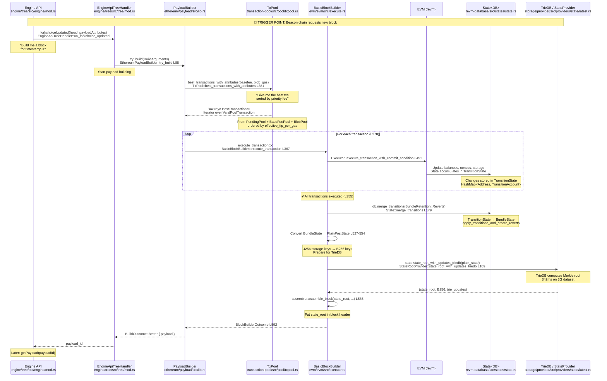
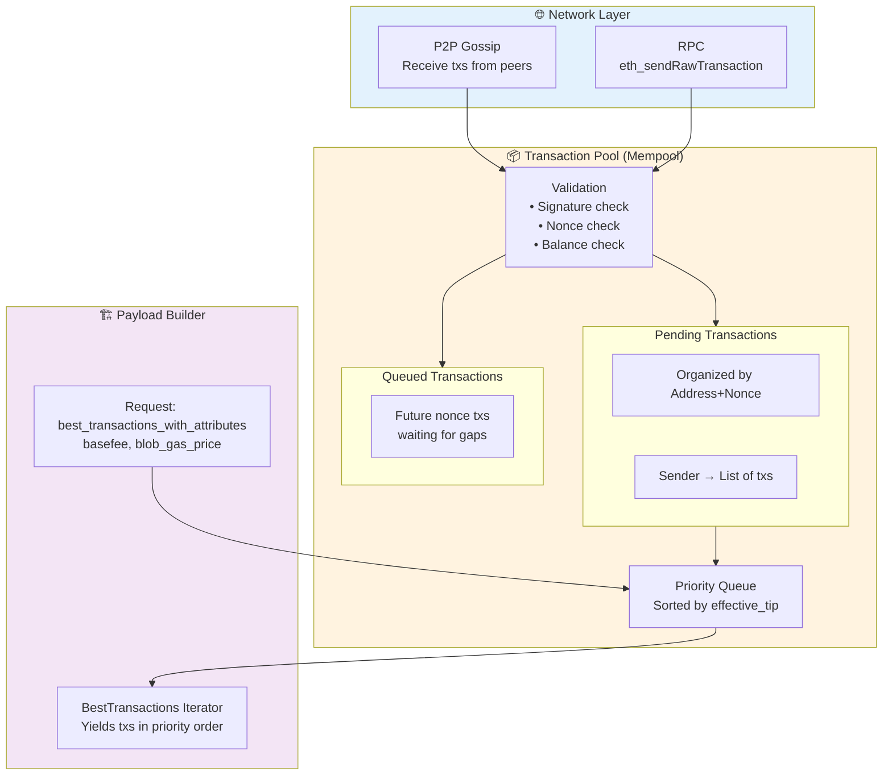
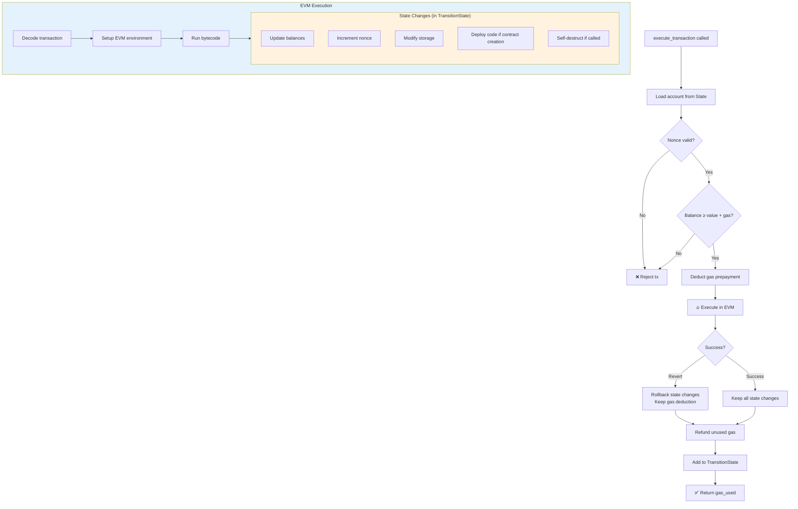
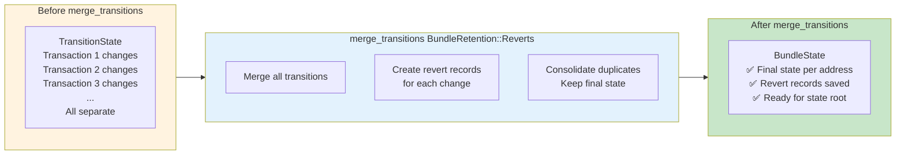
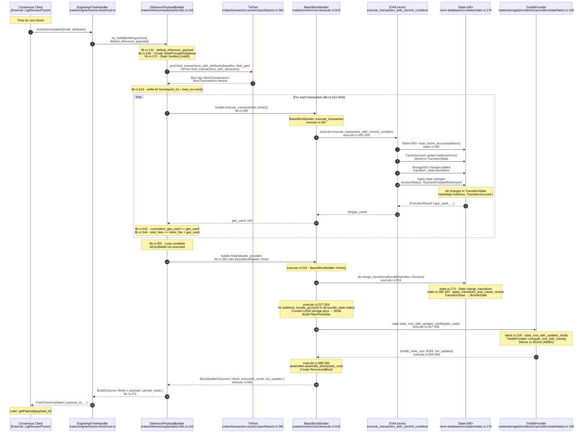
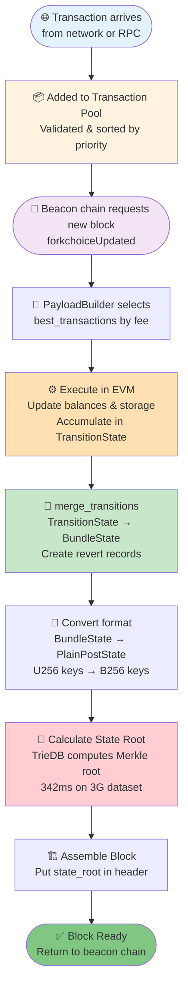

# Complete Block Execution Flow: From Transaction Pool to State Root

**Where does it all start? How do transactions get processed? Let me show you the COMPLETE picture.**

---

## The Big Picture: Who Triggers What



---

## 1. The Trigger Point: Where It All Begins

### Location: Engine API receives forkchoiceUpdated

```rust
// When consensus layer (beacon chain) sends forkchoiceUpdated with payload attributes
EngineAPI::forkchoiceUpdated(
    forkchoice_state,  // Current head, safe, finalized blocks
    payload_attributes, // timestamp, prev_randao, suggested_fee_recipient, withdrawals
)
```

**Who calls this?**
- External: Consensus client (Lighthouse, Prysm, etc.)
- Internal: Can also be triggered by local miner for testing

**What happens?**
1. Engine validates the forkchoice state
2. If `payload_attributes` is present → **Start building a new block**
3. Creates a payload job and returns `payload_id`

---

## 2. Transaction Selection: Where Transactions Come From

### The Transaction Pool (Mempool)



### How Transactions Get Selected

```rust
// From crates/ethereum/payload/src/lib.rs

pub fn default_ethereum_payload(...) {
    // 1. Get best transactions from pool
    let mut best_txs = best_txs(BestTransactionsAttributes::new(
        base_fee,           // Base fee of the block
        blob_gasprice,      // Blob gas price (for EIP-4844)
    ));
    
    // 2. Iterate through transactions in order of profitability
    while let Some(pool_tx) = best_txs.next() {
        // Check gas limit
        if cumulative_gas_used + pool_tx.gas_limit() > block_gas_limit {
            best_txs.mark_invalid(&pool_tx, ExceedsGasLimit);
            continue;  // Skip this tx and its descendants
        }
        
        // Check blob count (EIP-4844)
        if blob_count + tx_blob_count > max_blob_count {
            best_txs.mark_invalid(&pool_tx, TooManyBlobs);
            continue;
        }
        
        // 3. Execute transaction
        let gas_used = match builder.execute_transaction(tx.clone()) {
            Ok(gas_used) => gas_used,
            Err(error) => {
                // Mark invalid and skip descendants
                best_txs.mark_invalid(&pool_tx, error);
                continue;
            }
        };
        
        cumulative_gas_used += gas_used;
        total_fees += miner_fee * gas_used;
    }
    
    // 4. Finish block building
    let BlockBuilderOutcome { block, execution_result, .. } = 
        builder.finish(&state_provider)?;
}
```

**Key Points:**
- Transactions are sorted by `effective_tip_per_gas` (priority fee)
- Builder tries to maximize total fees while staying under gas limit
- Invalid transactions and their descendants are skipped
- Continues until gas limit reached or no more profitable transactions

---

## 3. Transaction Execution: What Happens Inside the EVM

### Location: `crates/evm/evm/src/execute.rs`



### The State Object (from revm)

```rust
// From revm State structure
pub struct State<DB> {
    /// Cached state: address → account info + storage
    cache: CacheState,
    
    /// Transition state: changes from current block's transactions
    /// This is what accumulates during execution!
    transition_state: Option<TransitionState>,
    
    /// Bundle state: final committed changes
    /// Created by merge_transitions()
    bundle_state: BundleState,
    
    /// Database access
    database: DB,
}

pub struct TransitionState {
    /// All account changes from transactions
    /// Maps: Address → BundleAccount (with storage changes)
    transitions: HashMap<Address, TransitionAccount>,
}

pub struct TransitionAccount {
    /// Account info changes
    info: Option<AccountInfo>,
    
    /// Status: Created | Touched | Destroyed
    status: AccountStatus,
    
    /// Storage slot changes
    /// Maps: U256 slot → StorageSlot
    storage: HashMap<U256, StorageSlot>,
    
    /// Previous storage values (for reverts)
    previous_storage: HashMap<U256, U256>,
}
```

**During transaction execution:**
1. Each `SSTORE` adds to `TransitionAccount.storage`
2. Balance changes update `TransitionAccount.info.balance`
3. Nonce increments update `TransitionAccount.info.nonce`
4. Contract deployment sets `TransitionAccount.info.code_hash`

---

## 4. merge_transitions: The Critical Transformation

### Location: `revm::State::merge_transitions()`

This is where individual transaction changes become a unified block state!



### What merge_transitions Does

```rust
// From revm-database/src/states/state.rs
impl<DB> State<DB> {
    pub fn merge_transitions(&mut self, retention: BundleRetention) {
        if let Some(transition_state) = self.transition_state.take() {
            // Apply transitions and create reverts
            self.bundle_state.apply_transitions_and_create_reverts(
                transition_state,
                retention  // BundleRetention::Reverts
            );
        }
    }
}

// What apply_transitions_and_create_reverts does:
// 1. For each address in TransitionState:
//    a. Merge storage changes (last write wins)
//    b. Merge balance changes
//    c. Track account status (created/destroyed)
//    d. Create revert record (for re-orgs)
//
// 2. Build final BundleState:
//    state: HashMap<Address, BundleAccount> {
//        0x1234...: BundleAccount {
//            info: Some(Account { nonce: 5, balance: 100 ETH, ... }),
//            status: Touched,
//            storage: {
//                U256(10): StorageSlot {
//                    previous_value: U256(0),
//                    present_value: U256(42)  ← FINAL value after all txs
//                }
//            }
//        }
//    }
```

**Example: Multiple Transactions Changing Same Storage**

```rust
// Initial state: account 0xABCD has storage[slot 5] = 100

// Transaction 1: Sets storage[slot 5] = 200
TransitionState after tx1: {
    0xABCD: { storage: { 5: 200 } }
}

// Transaction 2: Sets storage[slot 5] = 300
TransitionState after tx2: {
    0xABCD: { storage: { 5: 200 } },  // tx1's change
    0xABCD: { storage: { 5: 300 } },  // tx2's change (separate!)
}

// merge_transitions() called:
BundleState = {
    0xABCD: BundleAccount {
        storage: {
            5: StorageSlot {
                previous_value: 100,   // Original value
                present_value: 300     // Final value (last write wins)
            }
        }
    }
}

// Revert record created:
Reverts[block_num] = {
    0xABCD: { storage: { 5: 100 } }  // Can revert to this if needed
}
```

---

## 5. State Root Calculation: The Final Step

### When It Happens

```rust
// In BasicBlockBuilder::finish()
fn finish(self, state: impl StateProvider) -> Result<BlockBuilderOutcome> {
    // Get execution result from EVM
    let (evm, result) = self.executor.finish()?;
    let (db, evm_env) = evm.finish();
    
    // 🔥 THIS IS THE CRITICAL CALL 🔥
    db.merge_transitions(BundleRetention::Reverts);
    
    // Now BundleState has final state of all accounts
    // db.bundle_state contains the complete picture
    
    // Convert BundleState → PlainPostState (for TrieDB)
    let mut plain_state = PlainPostState::default();
    for (address, bundle_account) in db.bundle_state.state() {
        // Convert each account
        plain_state.accounts.insert(*address, account);
        
        // Convert storage (U256 keys → B256 keys)
        for (slot, storage_slot) in &bundle_account.storage {
            let slot_b256 = B256::from_slice(&slot.to_be_bytes::<32>());
            storage_map.insert(slot_b256, storage_slot.present_value);
        }
        plain_state.storages.insert(*address, storage_map);
    }
    
    // Calculate state root using TrieDB
    let (state_root, trie_updates) = 
        state.state_root_with_updates_triedb(plain_state)?;
    
    // Assemble final block with state_root in header
    let block = self.assembler.assemble_block(BlockAssemblerInput {
        state_root,  // ← Goes into block header
        transactions,
        ...
    })?;
    
    Ok(BlockBuilderOutcome { block, execution_result, trie_updates })
}
```

---

## 6. Complete Flow with Line Numbers



---

## 7. Data Structures at Each Stage

### Stage 1: Transactions in Pool

```rust
ValidPoolTransaction {
    transaction: TransactionSigned,  // Signed tx with signature
    transaction_id: TransactionId,   // Unique ID
    propagate: bool,                 // Should broadcast to peers?
    timestamp: Instant,              // When added to pool
    origin: TransactionOrigin,       // Local or External
    submission_id: u64,              // Ordering
}
```

### Stage 2: During Execution (TransitionState)

```rust
// Inside State<DB> during execution
TransitionState {
    transitions: HashMap<Address, TransitionAccount> {
        0x1234...: TransitionAccount {
            info: Some(AccountInfo {
                nonce: 5,
                balance: 100_000_000_000_000_000_000,  // 100 ETH
                code_hash: Some(0x5678...),
            }),
            status: Touched,
            storage: {
                U256(10): StorageSlot {
                    previous_or_original_value: U256(0),
                    present_value: U256(42),
                }
            }
        }
    }
}
```

### Stage 3: After merge_transitions (BundleState)

```rust
BundleState {
    state: HashMap<Address, BundleAccount> {
        0x1234...: BundleAccount {
            info: Some(AccountInfo { ... }),  // Final account info
            status: Touched,
            storage: HashMap<U256, StorageSlot> {
                U256(10): StorageSlot {
                    previous_or_original_value: U256(0),   // Before block
                    present_value: U256(42)                 // After block
                }
            }
        }
    },
    reverts: Vec<Vec<(Address, AccountRevert)>>,  // For re-org handling
}
```

### Stage 4: For State Root (PlainPostState)

```rust
PlainPostState {
    accounts: HashMap<Address, Option<Account>> {
        0x1234...: Some(Account {
            nonce: 5,
            balance: U256::from(100_000_000_000_000_000_000u128),
            bytecode_hash: Some(0x5678...),
        })
    },
    storages: HashMap<Address, HashMap<B256, U256>> {
        0x1234...: {
            B256(keccak256(10)): U256(42)  // Converted to B256 key!
        }
    }
}
```

### Stage 5: Final Block

```rust
Block {
    header: Header {
        parent_hash: 0xabcd...,
        number: 12345,
        state_root: 0xef01...,  // ← Calculated state root!
        transactions_root: 0x2345...,
        receipts_root: 0x6789...,
        gas_used: 21_000_000,
        timestamp: 1704240000,
        ...
    },
    body: BlockBody {
        transactions: Vec<TransactionSigned>,
        ommers: Vec<Header>,
        withdrawals: Option<Withdrawals>,
    }
}
```

---

## 8. Key Questions Answered

### Q: Where do transactions come from?

**A:** Transaction Pool (Mempool)
- Received from: P2P network (gossip) or RPC (eth_sendRawTransaction)
- Validated: Signature, nonce, balance checks
- Organized: By sender address and nonce
- Sorted: By effective_tip_per_gas (profitability)

### Q: How does payload builder pick transactions?

**A:** `best_transactions_with_attributes(basefee, blob_gas)`
- Returns an iterator that yields transactions in order of profitability
- Higher priority fee = selected first
- Continues until gas limit or no profitable txs remain

### Q: What is merge_transitions doing?

**A:** Consolidates all transaction changes into final block state
1. Takes `TransitionState` (individual tx changes)
2. Merges them into `BundleState` (final per-account state)
3. Creates revert records (for handling re-orgs)
4. Last write wins for conflicting changes

### Q: When is state root calculated?

**A:** After all transactions executed and merged
1. Execute all transactions → TransitionState
2. `merge_transitions()` → BundleState
3. Convert BundleState → PlainPostState
4. `state_root_with_updates_triedb()` → state_root
5. Assemble block with state_root in header

### Q: Why convert BundleState to PlainPostState?

**A:** Different key formats
- `BundleState`: Uses `U256` storage keys (EVM format)
- `PlainPostState`: Uses `B256` storage keys (32-byte format)
- TrieDB needs plain addresses (not hashed yet)
- Hashing happens inside TrieDB

---

## 9. The Complete Call Stack

```
1. Engine API receives forkchoiceUpdated()
   └─> crates/engine/tree/src/tree/mod.rs
       └─> EngineApiTreeHandler::on_forkchoice_updated()

2. Create payload building job
   └─> crates/payload/builder/src/service.rs
       └─> PayloadBuilderService::poll()

3. PayloadBuilder::try_build()
   └─> crates/ethereum/payload/src/lib.rs:88
       └─> impl PayloadBuilder for EthereumPayloadBuilder

4. default_ethereum_payload()
   └─> crates/ethereum/payload/src/lib.rs:142
       └─> Setup: StateProviderDatabase (L169)
       └─> Create: State::builder().with_bundle_update().build() (L172)
   
5. Get best transactions from pool
   └─> pool.best_transactions_with_attributes(BestTransactionsAttributes)
       └─> crates/transaction-pool/src/lib.rs:595
           └─> Pool::best_transactions_with_attributes()
               └─> crates/transaction-pool/src/pool/mod.rs:766
                   └─> TxPool::best_transactions_with_attributes()
                       └─> crates/transaction-pool/src/pool/txpool.rs:381
   
6. For each transaction (L214-343 loop):
   builder.execute_transaction(tx)
   └─> crates/evm/evm/src/execute.rs:367
       └─> BasicBlockBuilder::execute_transaction()
           └─> execute.rs:491
               └─> executor.execute_transaction_with_commit_condition()
                   └─> Calls revm EVM::transact()
                       └─> State<DB> accumulates changes in TransitionState
   
7. EVM execution (revm internals)
   └─> revm::Evm::transact()
       └─> State::load_cache_account() - state.rs:190
       └─> CacheAccount modifications stored in TransitionState
       └─> transition_state.transitions: HashMap<Address, TransitionAccount>
   
8. After all transactions (L355):
   db.merge_transitions(BundleRetention::Reverts)
   └─> .cargo/registry/.../revm-database-9.0.5/src/states/state.rs:179
       └─> State::merge_transitions()
           └─> bundle_state.apply_transitions_and_create_reverts() - L182
               └─> Creates final BundleState with revert records
   
9. Convert to PlainPostState
   └─> crates/evm/evm/src/execute.rs:527-554
       └─> Loop: for (address, bundle_account) in db.bundle_state.state()
           └─> Convert U256 storage keys → B256 keys
           └─> Build PlainPostState { accounts, storages }
   
10. Calculate state root
    state.state_root_with_updates_triedb(plain_state)
    └─> crates/evm/evm/src/execute.rs:557-558
        └─> crates/storage/provider/src/providers/state/latest.rs:109
            └─> LatestStateProviderRef::state_root_with_updates_triedb()
                └─> Get TriedbProvider and begin read transaction
                └─> Build OverlayStateMut from PlainPostState
                └─> tx.compute_root_with_overlay(overlay)
                └─> Returns (root: B256, TrieUpdates)
    
11. Assemble block
    assembler.assemble_block(state_root, ...)
    └─> crates/evm/evm/src/execute.rs:585-592
        └─> BlockAssemblerInput with state_root in header
        └─> Returns BlockBuilderOutcome
    
12. Return built payload
    └─> crates/ethereum/payload/src/lib.rs:374
        └─> BuildOutcome::Better { payload, cached_reads }
            └─> Engine API returns ForkChoiceUpdated with payload_id
```

---

## Summary: The Journey of a Transaction



---

**Now you understand the complete flow from transaction pool to state root!** 🎉
