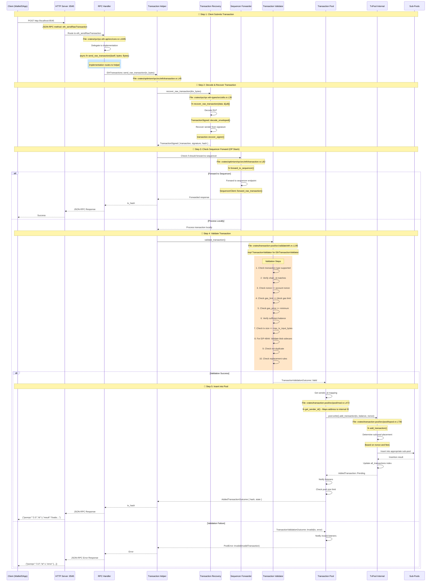
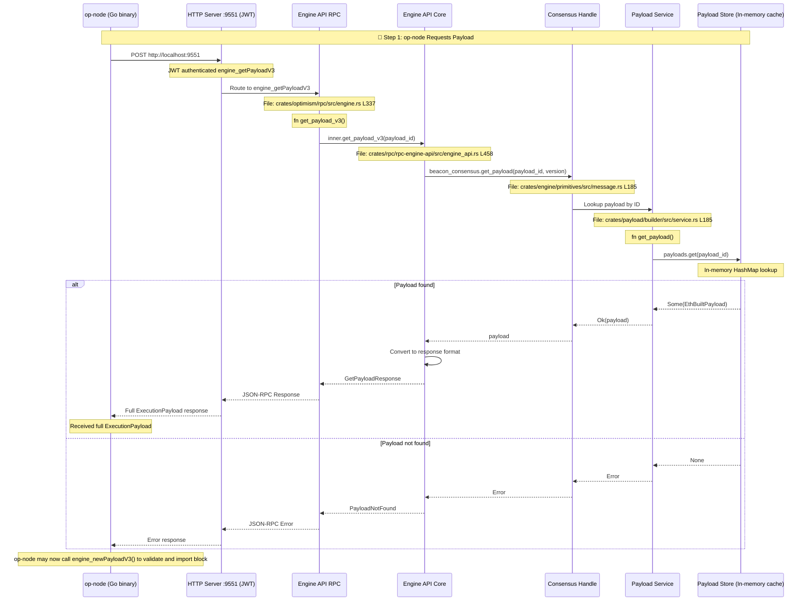

# Complete Transaction & Block Building Flow

## Overview

This document shows the **complete end-to-end flow** with exact file paths, function names, RPC endpoints, and API methods for:

1. **Transaction Submission**: Client → RPC → Validation → TxPool
2. **Block Building (op-node → op-reth)**: FCU call → Payload building → Return payload_id
3. **Payload Retrieval**: engine_getPayloadV3 → Return full payload

---

## Flow 1: Transaction Submission from Client to TxPool

---

## Flow 2: Block Building - op-node → op-reth (engine_forkchoiceUpdatedV3)

```mermaid
sequenceDiagram
    participant OpNode as op-node (Go binary)
    participant L1 as L1 Monitor
    participant HTTP as HTTP Server :9551 (JWT)
    participant EngineRPC as Engine API RPC
    participant EngineAPI as Engine API Core
    participant Consensus as Consensus Handle
    participant TreeHandler as EngineApiTreeHandler
    participant PayloadService as Payload Service
    participant PayloadBuilder as EthereumPayloadBuilder
    participant TxPool as Transaction Pool
    participant BlockBuilder as Block Builder
    participant StateRoot as State Root (TrieDB)

    Note over OpNode,StateRoot: 📍 Step 1: op-node Derives L2 Block from L1

    L1->>OpNode: Batcher transaction detected
    Note over OpNode: Decompress and decode L2 block data

    OpNode->>OpNode: Construct PayloadAttributes

    Note over OpNode,StateRoot: 📍 Step 2: op-node Calls engine_forkchoiceUpdatedV3

    OpNode->>HTTP: POST http://localhost:9551
    Note over HTTP: JWT authenticated engine_forkchoiceUpdatedV3

    HTTP->>EngineRPC: Route to engine_forkchoiceUpdatedV3
    Note over EngineRPC: File: crates/optimism/rpc/src/engine.rs L328

    EngineRPC->>EngineRPC: Validate JWT token
    EngineRPC->>EngineRPC: Parse request parameters
    Note over EngineRPC: ForkchoiceState + OpPayloadAttributes

    EngineRPC->>EngineAPI: inner.fork_choice_updated_v3_metered()
    Note over EngineAPI: File: crates/rpc/rpc-engine-api/src/engine_api.rs

    EngineAPI->>EngineAPI: Record metrics

    EngineAPI->>Consensus: beacon_consensus.fork_choice_updated()
    Note over Consensus: File: crates/engine/primitives/src/message.rs L228

    Consensus->>TreeHandler: Send ForkchoiceUpdated message
    Note over TreeHandler: File: crates/engine/tree/src/tree/mod.rs L1019
    Note over TreeHandler: fn on_forkchoice_updated()

    Note over OpNode,StateRoot: 📍 Step 3: Process Fork Choice Update

    TreeHandler->>TreeHandler: Update fork choice state
    Note over TreeHandler: File: crates/engine/tree/src/tree/mod.rs L1391
    Note over TreeHandler: fn on_engine_message()
    TreeHandler->>TreeHandler: Set head, safe, finalized blocks
    Note over TreeHandler: self.make_canonical()

    alt Has PayloadAttributes
        Note over OpNode,StateRoot: 📍 Step 4: Initiate Payload Building

        TreeHandler->>PayloadService: Start payload job
        Note over PayloadService: File: crates/payload/builder/src/service.rs L145
        Note over PayloadService: fn new_payload()

        PayloadService->>PayloadService: Generate payload_id
        Note over PayloadService: File: crates/payload/builder/src/service.rs L163
        Note over PayloadService: payload_id = hash(parent_hash, timestamp, random)

        PayloadService->>PayloadBuilder: spawn_payload_job()
        Note over PayloadBuilder: File: crates/ethereum/payload/src/lib.rs L88
        Note over PayloadBuilder: fn try_build()

        rect rgb(200, 255, 200)
            Note over PayloadBuilder,StateRoot: 📍 Step 5: Build Payload

            PayloadBuilder->>PayloadBuilder: Initialize payload attributes
            PayloadBuilder->>PayloadBuilder: Apply pre-execution changes

            alt OP Stack with no_tx_pool=true
                Note over PayloadBuilder: Use transactions from PayloadAttributes
                PayloadBuilder->>PayloadBuilder: Use provided transactions
            else Standard mode
                Note over PayloadBuilder: Use transactions from pool
                PayloadBuilder->>TxPool: best_transactions()
                Note over TxPool: File: crates/transaction-pool/src/pool/txpool.rs L381
                Note over TxPool: fn best_transactions_with_attributes()
                TxPool-->>PayloadBuilder: Iterator of best transactions
            end

            PayloadBuilder->>BlockBuilder: Execute transactions
            Note over BlockBuilder: File: crates/ethereum/payload/src/lib.rs L195
            Note over BlockBuilder: fn execute_transactions()

            loop For each transaction
                BlockBuilder->>BlockBuilder: execute_and_verify_receipt()
                Note over BlockBuilder: File: crates/evm/evm/src/execute.rs L515
                Note over BlockBuilder: impl BlockExecutor

                BlockBuilder->>BlockBuilder: Apply state changes
                BlockBuilder->>BlockBuilder: Update cumulative gas
                BlockBuilder->>BlockBuilder: Check block gas limit

                alt Transaction successful
                    BlockBuilder->>BlockBuilder: Include in block
                else Transaction failed
                    BlockBuilder->>BlockBuilder: Skip transaction
                end
            end

            Note over PayloadBuilder,StateRoot: 📍 Step 6: Calculate State Root (TrieDB)

            PayloadBuilder->>StateRoot: state_root_with_updates_triedb()
            Note over StateRoot: File: crates/storage/provider/src/providers/state/latest.rs L109
            Note over StateRoot: fn state_root_with_updates_triedb()

            StateRoot->>StateRoot: Convert BundleState to TrieDB updates
            Note over StateRoot: BundleStateWithReceipts.state_updates()
            StateRoot->>StateRoot: Calculate intermediate hashes
            Note over StateRoot: TrieDBMut::from_existing()
            StateRoot->>StateRoot: Build modified branches
            Note over StateRoot: trie.insert_batch()
            StateRoot->>StateRoot: Compute merkle root
            Note over StateRoot: trie.root() - TrieDB: 342ms vs 952ms (2.8x faster)

            StateRoot-->>PayloadBuilder: state_root: B256

            PayloadBuilder->>PayloadBuilder: Construct ExecutionPayload
            Note over PayloadBuilder: File: crates/ethereum/payload/src/lib.rs L267
            Note over PayloadBuilder: EthBuiltPayload::new() - Includes state_root from TrieDB

            PayloadBuilder->>PayloadBuilder: Store payload in memory
        end

        PayloadService->>PayloadService: Store payload with payload_id
        Note over PayloadService: File: crates/payload/builder/src/service.rs L198
        Note over PayloadService: self.payloads.insert(payload_id, payload)
        PayloadService-->>TreeHandler: payload_id

        TreeHandler-->>Consensus: PayloadStatus + payload_id
        Consensus-->>EngineAPI: ForkchoiceUpdated { payload_status, payload_id }

        EngineAPI->>EngineAPI: Record metrics

        EngineAPI-->>EngineRPC: Response with payload_id
        EngineRPC-->>HTTP: JSON-RPC Response
        HTTP-->>OpNode: Response with payload_id

        Note over OpNode: Received payload_id for block building

    else No PayloadAttributes
        TreeHandler-->>Consensus: PayloadStatus (no payload_id)
        Consensus-->>EngineAPI: ForkchoiceUpdated { payload_status, payload_id: None }
        EngineAPI-->>EngineRPC: Response
        EngineRPC-->>HTTP: Response
        HTTP-->>OpNode: Success response
    end
```

---

## Flow 3: Payload Retrieval - engine_getPayloadV3

---

## Summary: Key Files and Functions

### Transaction Submission Path

| Component | File | Function | Line | Purpose |
|-----------|------|----------|------|---------|
| **RPC Handler** | `crates/rpc/rpc-eth-api/src/core.rs` | `send_raw_transaction()` | ~1005 | Main RPC entry point |
| **Transaction Helper** | `crates/optimism/rpc/src/eth/transaction.rs` | `send_raw_transaction()` | ~45 | Implementation for OP Stack |
| **Recovery** | `crates/rpc/rpc-eth-types/src/utils.rs` | `recover_raw_transaction()` | ~28 | Decode RLP and recover sender |
| **Sequencer Forward** | `crates/optimism/rpc/src/eth/transaction.rs` | `forward_to_sequencer()` | ~82 | Forward to sequencer if needed |
| **Validator** | `crates/transaction-pool/src/validate/eth.rs` | `validate_transaction()` | ~195 | Validate transaction rules |
| **Transaction Pool** | `crates/transaction-pool/src/pool/txpool.rs` | `add_transaction()` | ~736 | Insert into pool |
| **Best Transactions** | `crates/transaction-pool/src/pool/txpool.rs` | `best_transactions()` | ~381 | Get best txs for building |

### Block Building Path

| Component | File | Function | Line | Purpose |
|-----------|------|----------|------|---------|
| **Engine API RPC** | `crates/optimism/rpc/src/engine.rs` | `fork_choice_updated_v3()` | ~328 | RPC endpoint handler |
| **Engine API Core** | `crates/rpc/rpc-engine-api/src/engine_api.rs` | `fork_choice_updated_v3_metered()` | ~396 | Core FCU logic with metrics |
| **Consensus Handle** | `crates/engine/primitives/src/message.rs` | `fork_choice_updated()` | ~228 | Send message to engine |
| **Tree Handler** | `crates/engine/tree/src/tree/mod.rs` | `on_forkchoice_updated()` | ~1019 | Process FCU in tree |
| **Tree Engine** | `crates/engine/tree/src/tree/mod.rs` | `on_engine_message()` | ~1391 | Main engine message handler |
| **Payload Builder** | `crates/ethereum/payload/src/lib.rs` | `try_build()` | ~88 | Build execution payload |
| **Block Executor** | `crates/evm/evm/src/execute.rs` | `execute_and_verify_receipt()` | ~515 | Execute single transaction |
| **State Root (TrieDB)** | `crates/storage/provider/src/providers/state/latest.rs` | `state_root_with_updates_triedb()` | ~109 | Calculate state root with TrieDB |

### Payload Retrieval Path

| Component | File | Function | Line | Purpose |
|-----------|------|----------|------|---------|
| **Engine API RPC** | `crates/optimism/rpc/src/engine.rs` | `get_payload_v3()` | ~337 | RPC endpoint handler |
| **Engine API Core** | `crates/rpc/rpc-engine-api/src/engine_api.rs` | `get_payload_v3()` | ~458 | Core get payload logic |
| **Payload Service** | `crates/payload/builder/src/service.rs` | `get_payload()` | ~185 | Retrieve from in-memory cache |

---

## Key Concepts

### TrieDB Performance

- **State Root Calculation**: 342ms (TrieDB) vs 952ms (MDBX) = **2.8x faster**
- **Impact**: 48% faster block building throughput
- **File**: `crates/storage/provider/src/providers/state/latest.rs` L109

### Transaction Pool Sub-Pools

The transaction pool maintains 4 sub-pools:

1. **Pending**: Ready for inclusion (correct nonce, sufficient fees)
2. **Queued**: Future nonces, waiting for earlier transactions
3. **BaseFee**: Transactions that will be valid after base fee drops
4. **Blob**: EIP-4844 blob transactions (separate pool)

**File**: `crates/transaction-pool/src/pool/txpool.rs`

### OP Stack PayloadAttributes Extensions

OP Stack extends `PayloadAttributes` with:

- `transactions`: Optional list of transactions (sequencer mode)
- `no_tx_pool`: If true, only use provided transactions
- `gas_limit`: Optional gas limit override

**File**: `crates/optimism/node/src/payload.rs`

### JWT Authentication

All Engine API calls (port 9551) require JWT authentication:

1. Shared secret file between op-node and op-reth
2. JWT token in `Authorization: Bearer <token>` header
3. Token validated before processing request

**File**: `crates/rpc/rpc-engine-api/src/engine_api.rs`

---

## Port Summary

| Port | Purpose | Authentication | Methods |
|------|---------|----------------|---------|
| **8545** | Client RPC | None | `eth_sendRawTransaction`, `eth_getTransactionByHash`, etc. |
| **9551** | Engine API | JWT | `engine_forkchoiceUpdatedV3`, `engine_getPayloadV3`, `engine_newPayloadV3` |

---

## Complete Flow Summary

1. **Transaction Arrives**: Client → HTTP:8545 → RPC → Validation → TxPool (4 sub-pools)
2. **Block Building Trigger**: op-node → HTTP:9551 → Engine API → TreeHandler → PayloadBuilder
3. **Payload Building**: TxPool → BlockBuilder → Execute Transactions → TrieDB State Root (342ms) → Store with payload_id
4. **Payload Retrieval**: op-node → engine_getPayloadV3 → In-memory cache → Full ExecutionPayload
5. **Block Submission**: op-node → engine_newPayloadV3 → Validate and import block

---

## References

- **OP Node Code**: https://github.com/ethereum-optimism/optimism/tree/develop/op-node
- **Engine API Spec**: https://github.com/ethereum/execution-apis/tree/main/src/engine
- **OP Stack Engine API Extensions**: https://specs.optimism.io/protocol/exec-engine.html
