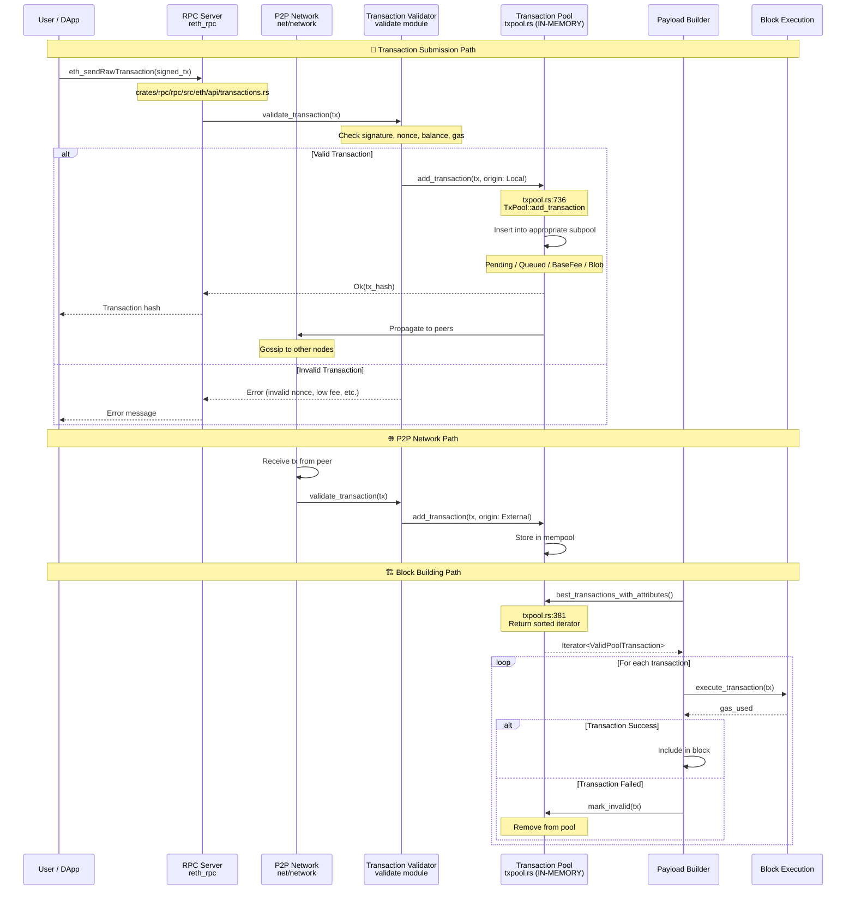

# Engine API, PayloadAttributes, and Transaction Pool (Mempool)

## Quick Answers to Your Questions:

### 1. Is engine_api call from reth_node?

**No, it's from the EXTERNAL consensus layer (beacon chain)**, not from reth_node itself.

```
Consensus Client          Execution Client
(Beacon Chain)           (Reth)
┌─────────────────┐      ┌──────────────────┐
│  Lighthouse     │      │   Reth Node      │
│  Prysm          │──────│   Engine API     │
│  Teku           │ HTTP │   Handler        │
│  Nimbus         │ RPC  │                  │
└─────────────────┘      └──────────────────┘
     External                  Internal
```

**File Location:**
- Reth receives at: `crates/engine/tree/src/tree/mod.rs` - `EngineApiTreeHandler`
- External call via HTTP JSON-RPC on port 8551 (default)

---

### 2. What goes into payload_attributes?

**Location:** `crates/ethereum/engine-primitives/src/payload.rs:317-362`

```rust
pub struct EthPayloadBuilderAttributes {
    /// Id of the payload (derived from parent + attributes)
    pub id: PayloadId,
    
    /// Parent block hash to build on top of
    pub parent: B256,  // 0xabcd...1234
    
    /// Unix timestamp for the new block
    /// Number of seconds since Unix epoch
    pub timestamp: u64,  // e.g., 1704240000 (2024-01-02 12:00:00)
    
    /// Address to send block rewards (coinbase)
    pub suggested_fee_recipient: Address,  // e.g., 0x1234...5678
    
    /// Randomness value (from beacon chain's RANDAO)
    pub prev_randao: B256,  // Used for random number generation
    
    /// Withdrawals to include in block (EIP-4895)
    pub withdrawals: Withdrawals,  // Beacon chain validator withdrawals
    
    /// Parent beacon block root (EIP-4788)
    pub parent_beacon_block_root: Option<B256>,  // For beacon chain verification
}
```

**Example payload_attributes from beacon chain:**

```json
{
  "timestamp": "0x65950fb0",
  "prevRandao": "0xabcdef1234567890abcdef1234567890abcdef1234567890abcdef1234567890",
  "suggestedFeeRecipient": "0x1234567890123456789012345678901234567890",
  "withdrawals": [
    {
      "index": "0x1",
      "validatorIndex": "0x5",
      "address": "0xabcdef...",
      "amount": "0x1234"
    }
  ],
  "parentBeaconBlockRoot": "0xfedcba..."
}
```

**This comes from:**
- Beacon chain (consensus layer) via `engine_forkchoiceUpdatedV3`
- Tells reth: "Build a block at timestamp X with these parameters"

---

### 3. Does reth store transactions in a mempool?

**YES! Absolutely.**

The mempool is called the **Transaction Pool** in reth.

**File Location:** `crates/transaction-pool/src/pool/mod.rs` and `txpool.rs`

```
┌─────────────────────────────────────────────────────────────┐
│             TRANSACTION POOL (Mempool)                      │
│                                                             │
│  ┌────────────────────┐  ┌────────────────────┐           │
│  │   Pending Pool     │  │   Queued Pool      │           │
│  │   (ready to exec)  │  │   (nonce gaps)     │           │
│  │   - nonce: 5       │  │   - nonce: 7       │           │
│  │   - nonce: 6       │  │   (waiting for 6)  │           │
│  └────────────────────┘  └────────────────────┘           │
│                                                             │
│  ┌────────────────────┐  ┌────────────────────┐           │
│  │  BaseFee Pool      │  │    Blob Pool       │           │
│  │  (fee too low)     │  │  (EIP-4844 blobs)  │           │
│  └────────────────────┘  └────────────────────┘           │
└─────────────────────────────────────────────────────────────┘
```

---

### 4. Does it pick best transactions from mempool?

**YES!** Via `best_transactions_with_attributes()` in `txpool.rs:381`

**Selection Algorithm:**

```rust
// From txpool.rs:381
pub(crate) fn best_transactions_with_attributes(
    &self,
    best_transactions_attributes: BestTransactionsAttributes,
) -> Box<dyn BestTransactions<Item = Arc<ValidPoolTransaction<T::Transaction>>>>
{
    // Returns an iterator that yields transactions sorted by:
    // 1. Priority fee (effective_tip_per_gas) - HIGHEST FIRST
    // 2. Nonce order (for same sender)
    // 3. Base fee and blob fee requirements met
}
```

**Sorting Priority:**
1. **Effective tip per gas** (priority fee) - Highest first
2. **Nonce order** - Must be sequential for same sender
3. **Base fee check** - Must meet current base fee
4. **Blob fee check** - Must meet blob gas price (EIP-4844)

---

### 5. Is txpool.rs the in-memory storage for mempool?

**YES! `txpool.rs` is the core in-memory storage.**

**Structure:**

```rust
// From txpool.rs
pub struct TxPool<T: TransactionOrdering> {
    /// Contains currently known sender info
    sender_info: FxHashMap<SenderId, SenderInfo>,
    
    /// Pending subpool - ready to execute
    pending_pool: PendingPool<T>,
    
    /// Queued subpool - nonce gaps or low balance
    queued_pool: ParkedPool<QueuedOrd<T::Transaction>>,
    
    /// Basefee subpool - fee too low currently
    basefee_pool: ParkedPool<BasefeeOrd<T::Transaction>>,
    
    /// Blob pool - EIP-4844 blob transactions
    blob_pool: BlobTransactions<T::Transaction>,
    
    /// ALL transactions by hash and ID
    all_transactions: AllTransactions<T::Transaction>,
}
```

**Key Data Structures:**

```rust
// All transactions stored in memory
pub(crate) struct AllTransactions<T: PoolTransaction> {
    /// By hash: TxHash → ValidPoolTransaction
    by_hash: HashMap<TxHash, Arc<ValidPoolTransaction<T>>>,
    
    /// By ID: (SenderId, Nonce) → Transaction
    txs: BTreeMap<TransactionId, PoolInternalTransaction<T>>,
    
    /// Transaction count per sender
    tx_counter: FxHashMap<SenderId, usize>,
}
```

---

## Complete Flow: How Transactions Get Into Mempool



---

## Where Transactions Come From

### Source 1: RPC API (Local Transactions)

**File:** `crates/rpc/rpc/src/eth/api/transactions.rs`

```rust
// User submits via JSON-RPC
eth_sendRawTransaction(signed_tx) 
  → validate_transaction()
  → pool.add_transaction(tx, TransactionOrigin::Local)
```

**Origin:** User's wallet, DApps, MEV bots

---

### Source 2: P2P Network (External Transactions)

**File:** `crates/net/network/src/transactions.rs`

```rust
// Received from P2P gossip
TransactionsManager::on_new_transactions(txs)
  → validate_transaction()
  → pool.add_transaction(tx, TransactionOrigin::External)
```

**Origin:** Other Ethereum nodes broadcasting transactions

---

### Source 3: Re-orgs (Previously Mined)

**When a re-org happens:**
- Mined transactions from orphaned blocks
- Re-inserted back into mempool
- Marked as `TransactionOrigin::Private`

---

## Transaction Pool API

**Adding Transactions:**

```rust
// From pool/mod.rs:472
fn add_transaction(
    &self,
    origin: TransactionOrigin,
    tx: EthPooledTransaction,
) -> PoolResult<TxHash> {
    // 1. Validate transaction
    let validated = self.validator.validate_transaction(origin, tx)?;
    
    // 2. Get sender info (nonce, balance)
    let sender_info = self.get_sender_info(validated.sender_id());
    
    // 3. Insert into pool
    let outcome = self.pool.write().add_transaction(
        validated,
        sender_info.on_chain_balance,
        sender_info.on_chain_nonce,
    )?;
    
    // 4. Notify listeners
    self.notify_transaction_added(outcome);
    
    Ok(tx_hash)
}
```

**Retrieving Best Transactions:**

```rust
// From pool/mod.rs:766
pub fn best_transactions_with_attributes(
    &self,
    best_transactions_attributes: BestTransactionsAttributes,
) -> Box<dyn BestTransactions> {
    self.get_pool_data()
        .best_transactions_with_attributes(best_transactions_attributes)
}
```

---

## Memory Storage Details

**Data is stored IN-MEMORY only:**

```rust
// From txpool.rs - all these are in-memory HashMaps/BTrees
struct TxPool {
    // In-memory hash map: TxHash → Transaction
    all_transactions.by_hash: HashMap<TxHash, Arc<ValidPoolTransaction>>,
    
    // In-memory BTree: (SenderId, Nonce) → Transaction
    all_transactions.txs: BTreeMap<TransactionId, PoolInternalTransaction>,
    
    // Subpools are all in-memory structures
    pending_pool: PendingPool,   // Vec/BTreeMap
    queued_pool: ParkedPool,     // HashMap
    basefee_pool: ParkedPool,    // HashMap
    blob_pool: BlobTransactions, // HashMap
}
```

**Size Limits:**

```rust
// From config
pub struct PoolConfig {
    pub max_account_slots: usize,      // Max txs per account (default: 16)
    pub pending_limit: SubPoolLimit,   // Pending pool size
    pub basefee_limit: SubPoolLimit,   // BaseFee pool size
    pub queued_limit: SubPoolLimit,    // Queued pool size
    pub blob_limit: SubPoolLimit,      // Blob pool size
}
```

**When pool is full:**
- Worst transactions are evicted (lowest fee)
- Descendant transactions also removed
- Metrics updated: `pending_transactions_evicted`

---

## Summary Table

| Question | Answer | File Location |
|----------|--------|---------------|
| **Engine API call from reth_node?** | No, from external beacon chain (Lighthouse/Prysm) | `engine/tree/src/tree/mod.rs` |
| **What's in payload_attributes?** | timestamp, prev_randao, fee_recipient, withdrawals, parent_beacon_root | `ethereum/engine-primitives/src/payload.rs:317` |
| **Does reth have a mempool?** | Yes! Called "Transaction Pool" | `transaction-pool/src/pool/` |
| **Pick best transactions?** | Yes, via `best_transactions_with_attributes()` sorted by priority fee | `transaction-pool/src/pool/txpool.rs:381` |
| **txpool.rs is in-memory storage?** | Yes! All HashMap/BTreeMap structures in RAM | `transaction-pool/src/pool/txpool.rs` |

---

## Transaction Lifecycle

```
1. User submits tx
   ↓
2. RPC validates
   ↓
3. Add to mempool (txpool.rs) - IN MEMORY
   ↓
4. Propagate to peers (P2P)
   ↓
5. Beacon chain requests block
   ↓
6. Payload builder queries: best_transactions_with_attributes()
   ↓
7. Mempool returns sorted iterator (highest fee first)
   ↓
8. Execute transactions in EVM
   ↓
9. Build block with state root
   ↓
10. Remove executed txs from mempool
```

**Key Point:** Mempool (txpool.rs) is the temporary in-memory holding area for pending transactions until they're included in a block! 🎯
