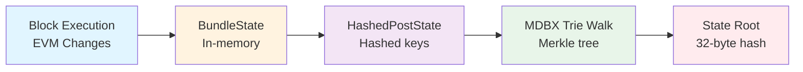
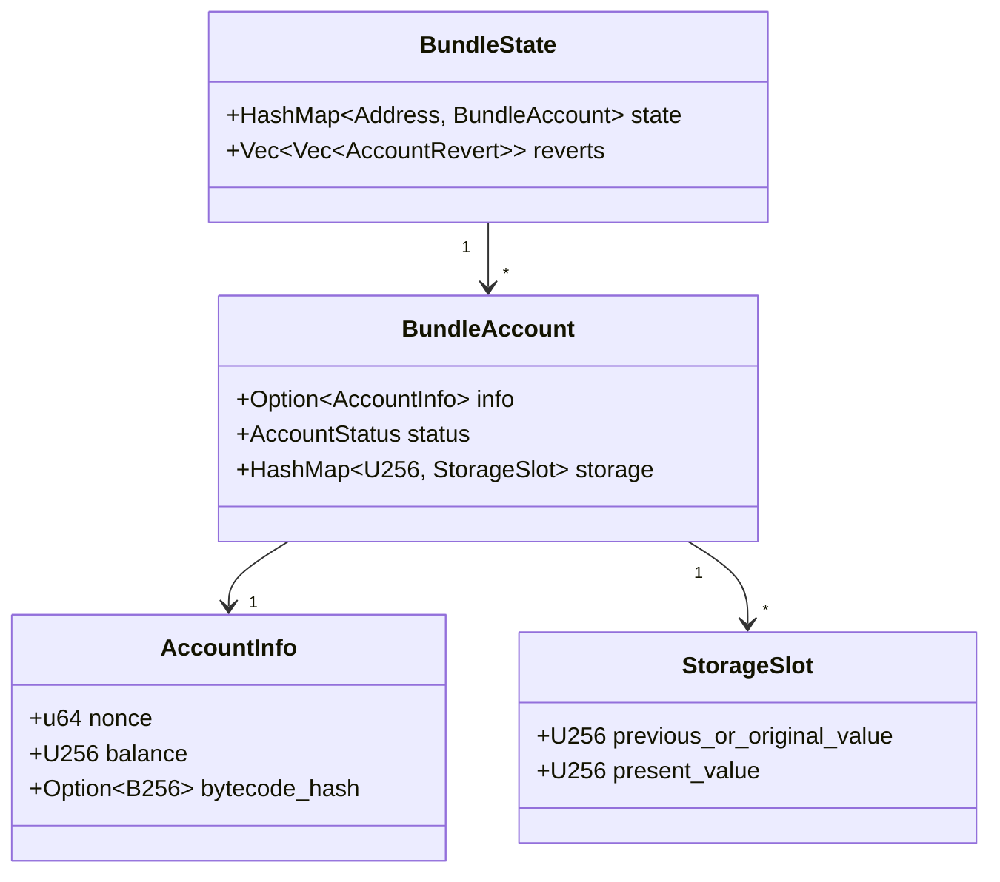
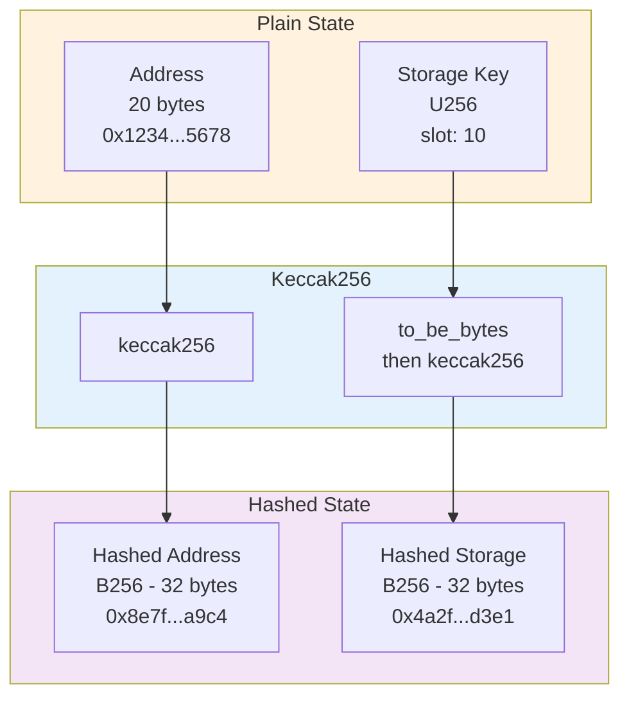
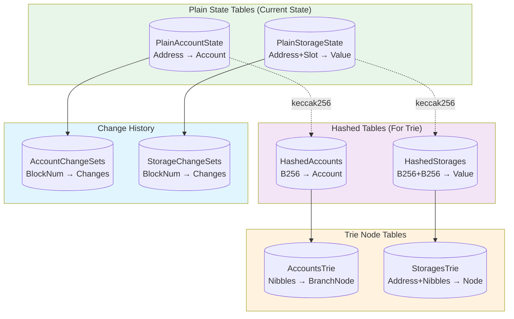
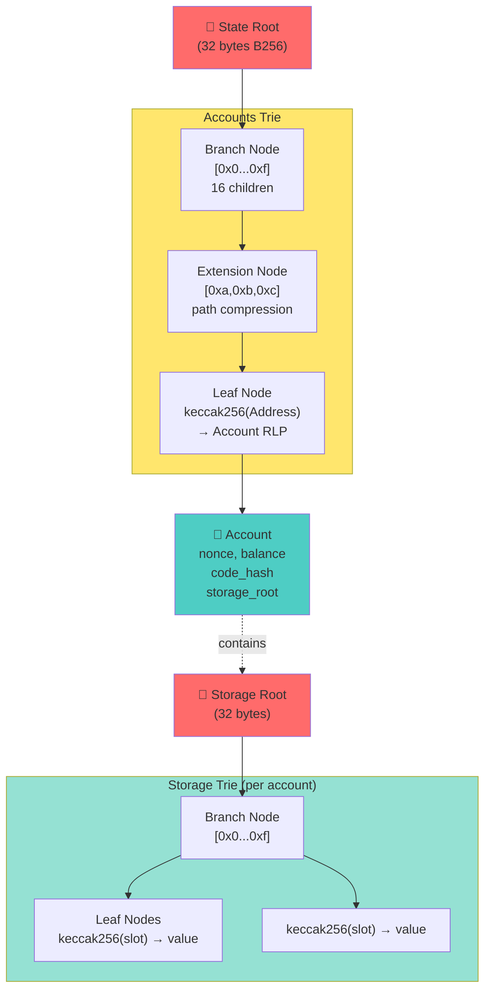
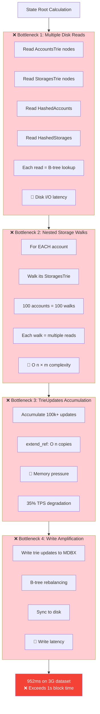
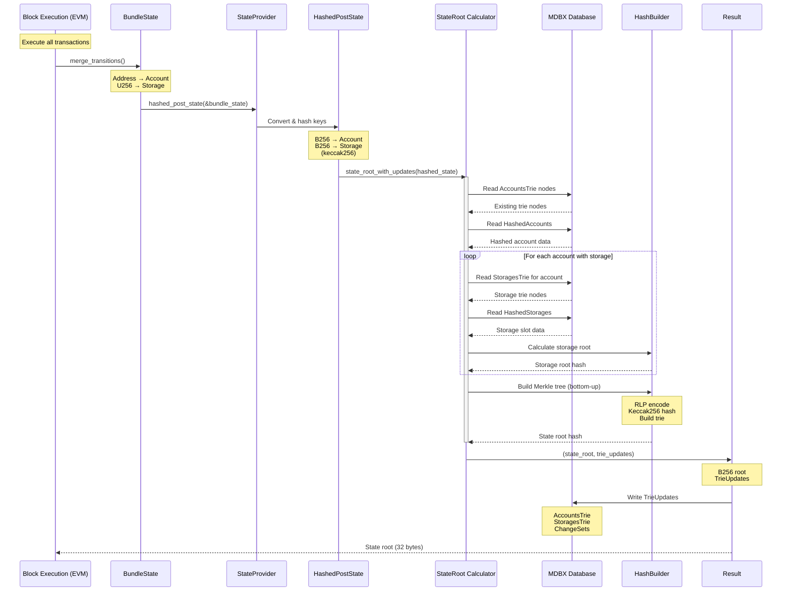
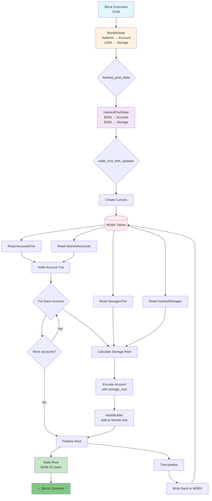

# MDBX State Root Calculation Flow (Previous Approach)

**Complete end-to-end explanation of how state root was calculated using MDBX before TrieDB integration.**

---

## Overview: The Complete Journey



---

## 1. Starting Point: Block Execution Creates BundleState

### Location: `crates/evm/evm/src/execute.rs`

When a block executes transactions, the EVM state changes are accumulated in `BundleState`:

```rust
// From revm (EVM execution engine)
pub struct BundleState {
    pub state: HashMap<Address, BundleAccount>,  // Account changes
    pub reverts: Vec<Vec<(Address, AccountRevert)>>,  // For reverting
}

pub struct BundleAccount {
    pub info: Option<AccountInfo>,  // New account state (or None if deleted)
    pub status: AccountStatus,      // Created | Touched | LoadedAsNotExisting | Destroyed
    pub storage: HashMap<U256, StorageSlot>,  // Storage slot changes
}

pub struct StorageSlot {
    pub previous_or_original_value: U256,  // Value before this block
    pub present_value: U256,               // Current value after execution
}
```

**Example after executing a transaction:**
```rust
BundleState {
    state: {
        0x1234...abcd: BundleAccount {
            info: Some(AccountInfo {
                nonce: 5,
                balance: 1000 ETH,
                code_hash: 0x5678...
            }),
            status: AccountStatus::Touched,
            storage: {
                U256::from(10): StorageSlot {
                    previous_or_original_value: U256::from(0),
                    present_value: U256::from(42)
                }
            }
        }
    }
}
```

### BundleState Structure Diagram:



### Data Flow in Block Execution:

```rust
// In execute.rs::BasicBlockBuilder::finish()
fn finish(self, state: impl StateProvider) -> Result<BlockBuilderOutcome<N>, BlockExecutionError> {
    // ... execute all transactions ...
    
    // Merge all state transitions into BundleState
    db.merge_transitions(BundleRetention::Reverts);
    
    // BundleState now contains ALL account and storage changes from the block
    let bundle_state: BundleState = db.bundle_state;
    
    // STEP 1: Convert to HashedPostState
    let hashed_state = state.hashed_post_state(&bundle_state);
    
    // STEP 2: Calculate state root using MDBX
    let (mdbx_state_root, trie_updates) = state
        .state_root_with_updates(hashed_state)
        .map_err(BlockExecutionError::other)?;
}
```

---

## 2. Conversion: BundleState → HashedPostState

### Location: `crates/trie/common/src/hashed_state.rs`

The first transformation hashes all addresses and storage keys using Keccak256:

```rust
pub struct HashedPostState {
    /// Mapping of HASHED address → account info (None = deleted)
    pub accounts: B256Map<Option<Account>>,
    
    /// Mapping of HASHED address → hashed storage slots
    pub storages: B256Map<HashedStorage>,
}

pub struct HashedStorage {
    /// Whether this account was wiped (all storage cleared)
    pub wiped: bool,
    
    /// Hashed storage key → value (None = deleted slot)
    pub storage: B256Map<Option<U256>>,
}
```

### Conversion Process:

```rust
impl HashedPostState {
    pub fn from_bundle_state<'a, KH: KeyHasher>(
        state: impl IntoIterator<Item = (&'a Address, &'a BundleAccount)>,
    ) -> Self {
        let hashed = state
            .into_iter()
            .map(|(address, account)| {
                // Hash the address: Address → B256
                let hashed_address = KH::hash_key(address);  // keccak256(address)
                
                // Extract account info
                let hashed_account = account.info.as_ref().map(Into::into);
                
                // Hash storage: convert U256 keys → B256 keys
                let hashed_storage = HashedStorage::from_plain_storage(
                    account.status,
                    account.storage.iter().map(|(slot, value)| (slot, &value.present_value)),
                );
                
                (hashed_address, (hashed_account, hashed_storage))
            })
            .collect();
        
        // Build the HashedPostState from collected hashed data
        Self { accounts, storages }
    }
}
```

**Why hash?** 
- Merkle Patricia Tries use hashed keys to ensure uniform distribution
- Prevents key length attacks (all keys become 32 bytes)
- Ethereum specification requires keccak256 hashing

**Hashing Transformation:**



---

## 3. Storage Structures in MDBX Database

### Database Tables (from `crates/storage/db-api/src/tables/mod.rs`)

MDBX stores the state in several tables:

#### PlainAccountState
```rust
table PlainAccountState {
    Key = Address,           // 20-byte unhashed address
    Value = Account,         // Account data
}

pub struct Account {
    pub nonce: u64,
    pub balance: U256,
    pub bytecode_hash: Option<B256>,
}
```

#### PlainStorageState
```rust
table PlainStorageState {
    Key = Address,                 // Account address
    SubKey = B256,                 // Storage key (32 bytes)
    Value = StorageEntry,
}

pub struct StorageEntry {
    pub key: B256,      // Storage slot
    pub value: U256,    // Storage value
}
```

#### HashedAccounts (for trie)
```rust
table HashedAccounts {
    Key = B256,         // keccak256(Address)
    Value = Account,    // Account data
}
```

#### HashedStorages (for trie)
```rust
table HashedStorages {
    Key = B256,         // keccak256(Address)
    SubKey = B256,      // keccak256(storage_slot)
    Value = U256,       // Storage value
}
```

#### AccountsTrie (intermediate nodes)
```rust
table AccountsTrie {
    Key = StoredNibbles,       // Trie path (nibbles = half-bytes)
    Value = StoredBranchNode,  // Branch or extension node
}
```

#### StoragesTrie (storage trie nodes)
```rust
table StoragesTrie {
    Key = StoredNibblesSubKey,  // (hashed_address, trie_path)
    Value = StoredBranchNode,   // Storage trie branch nodes
}
```

**MDBX Tables Architecture:**



**Key insight:** 
- `PlainAccountState` and `PlainStorageState` store the actual current state (fast lookups)
- `HashedAccounts` and `HashedStorages` store hashed state (for trie building)
- `AccountsTrie` and `StoragesTrie` store intermediate Merkle trie nodes (for incremental updates)

---

## 4. State Root Calculation: Walking the Merkle Patricia Trie

### Entry Point: `crates/trie/db/src/state.rs`

```rust
impl<'a, TX: DbTx> DatabaseStateRoot<'a, TX> for StateRoot<...> {
    fn overlay_root_with_updates(
        tx: &'a TX,
        post_state: HashedPostState,
    ) -> Result<(B256, TrieUpdates), StateRootError> {
        // 1. Build prefix sets (which parts of trie changed)
        let prefix_sets = post_state.construct_prefix_sets().freeze();
        
        // 2. Sort the hashed state for efficient iteration
        let state_sorted = post_state.into_sorted();
        
        // 3. Create StateRoot calculator
        StateRoot::new(
            DatabaseTrieCursorFactory::new(tx),           // For reading existing trie
            HashedPostStateCursorFactory::new(
                DatabaseHashedCursorFactory::new(tx),     // For reading hashed DB tables
                &state_sorted                              // Overlay of new changes
            ),
        )
        .with_prefix_sets(prefix_sets)
        .root_with_updates()  // Calculate!
    }
}
```

### The Calculation: `crates/trie/trie/src/trie.rs`

```rust
impl<T, H> StateRoot<T, H> {
    fn calculate(self, retain_updates: bool) -> Result<StateRootProgress, StateRootError> {
        // Create cursors for walking DB
        let trie_cursor = self.trie_cursor_factory.account_trie_cursor()?;
        let hashed_account_cursor = self.hashed_cursor_factory.hashed_account_cursor()?;
        
        // Initialize hash builder (builds Merkle tree bottom-up)
        let mut hash_builder = HashBuilder::default();
        
        // Create walker for traversing trie
        let walker = TrieWalker::state_trie(trie_cursor, self.prefix_sets.account_prefix_set);
        let mut account_node_iter = TrieNodeIter::state_trie(walker, hashed_account_cursor);
        
        // MAIN LOOP: Walk through all accounts
        while let Some(node) = account_node_iter.try_next()? {
            match node {
                TrieElement::Branch(node) => {
                    // Intermediate trie node
                    hash_builder.add_branch(node.key, node.value, node.children_are_in_trie);
                }
                
                TrieElement::Leaf(hashed_address, account) => {
                    // Actual account - need to calculate its storage root first!
                    
                    // Calculate storage root for this account
                    let storage_root_calculator = StorageRoot::new_hashed(
                        self.trie_cursor_factory.clone(),
                        self.hashed_cursor_factory.clone(),
                        hashed_address,
                        self.prefix_sets.storage_prefix_sets
                            .get(&hashed_address)
                            .cloned()
                            .unwrap_or_default(),
                    );
                    
                    let storage_result = storage_root_calculator.calculate(retain_updates)?;
                    let (storage_root, _, storage_updates) = storage_result.complete();
                    
                    // Encode account with storage root
                    let trie_account = account.into_trie_account(storage_root);
                    let mut account_rlp = Vec::new();
                    trie_account.encode(&mut account_rlp);
                    
                    // Add to hash builder
                    hash_builder.add_leaf(Nibbles::unpack(hashed_address), &account_rlp);
                }
            }
        }
        
        // Build final root hash
        let root = hash_builder.root();
        
        Ok(StateRootProgress::Complete(root, hashed_entries_walked, trie_updates))
    }
}
```

---

## 5. Storage Root Calculation (Nested)

For each account, we need to calculate its storage root:

```rust
impl<T, H> StorageRoot<T, H> {
    pub fn calculate(self, retain_updates: bool) -> Result<StorageRootProgress, StorageRootError> {
        let mut hashed_storage_cursor =
            self.hashed_cursor_factory.hashed_storage_cursor(self.hashed_address)?;
        
        // Short circuit if no storage
        if hashed_storage_cursor.is_storage_empty()? {
            return Ok(StorageRootProgress::Complete(EMPTY_ROOT_HASH, 0, StorageTrieUpdates::deleted()));
        }
        
        let trie_cursor = self.trie_cursor_factory.storage_trie_cursor(self.hashed_address)?;
        let mut hash_builder = HashBuilder::default();
        let walker = TrieWalker::storage_trie(trie_cursor, self.prefix_set);
        let mut storage_node_iter = TrieNodeIter::storage_trie(walker, hashed_storage_cursor);
        
        // Walk storage trie
        while let Some(node) = storage_node_iter.try_next()? {
            match node {
                TrieElement::Branch(node) => {
                    hash_builder.add_branch(node.key, node.value, node.children_are_in_trie);
                }
                TrieElement::Leaf(hashed_slot, value) => {
                    hash_builder.add_leaf(
                        Nibbles::unpack(hashed_slot),
                        alloy_rlp::encode_fixed_size(&value).as_ref(),
                    );
                }
            }
        }
        
        let storage_root = hash_builder.root();
        Ok(StorageRootProgress::Complete(storage_root, entries_walked, trie_updates))
    }
}
```

---

## 6. The Merkle Patricia Trie Structure

### What's being built:



### Nibbles (half-bytes):

Trie paths use nibbles (4-bit values) instead of bytes:
```
Address hash: 0xabcd1234
  Nibbles:    [a, b, c, d, 1, 2, 3, 4]
              ↑ Each is 4 bits (0-15)
```

### Branch Nodes:

```rust
pub struct BranchNode {
    pub state_mask: u16,     // Bitmask: which of 16 children exist
    pub tree_mask: u16,      // Bitmask: which children are in trie DB
    pub hash_mask: u16,      // Bitmask: which children are hashed
    pub hashes: Vec<B256>,   // Child hashes
    pub root_hash: Option<B256>,  // This node's hash
}
```

Example:
```
Branch at path [0xa]:
  state_mask:  0b0000_0001_0010_0000  (children at indices 5 and 8)
  Children:
    [0xa, 0x5] → Extension node
    [0xa, 0x8] → Leaf node
```

---

## 7. TrieUpdates: What Changed

After calculation, we get `TrieUpdates`:

```rust
pub struct TrieUpdates {
    /// Updated account trie nodes: path → encoded node
    pub account_nodes: B256Map<BranchNodeCompact>,
    
    /// Removed trie node keys
    pub removed_nodes: HashSet<Nibbles>,
    
    /// Storage trie updates per account
    pub storage_tries: B256Map<StorageTrieUpdates>,
    
    /// Accounts that were destroyed
    pub destroyed_accounts: HashSet<B256>,
}
```

These updates are later written back to MDBX:
- New/modified nodes → `AccountsTrie`, `StoragesTrie` tables
- Removed nodes deleted from trie tables
- Changes logged in `AccountChangeSets`, `StorageChangeSets`

---

## 8. The Problem: Why This Was Slow

### Performance Bottlenecks:



**Detailed Analysis:**

1. **Multiple MDBX Reads:**
   - Read existing trie nodes from `AccountsTrie`
   - Read existing storage nodes from `StoragesTrie`
   - Read hashed state from `HashedAccounts`, `HashedStorages`
   - Each read is a B-tree lookup with disk I/O

2. **Storage Root Calculation:**
   - For EACH account with changed storage, walk its storage trie
   - 100 accounts with storage changes = 100 storage trie walks
   - Each walk reads multiple trie nodes from disk

3. **TrieUpdates Accumulation:**
   ```rust
   // From benchmarks:
   // With high cache (1M accounts):
   // - Accumulates ~100k trie node updates
   // - extend_ref() copies all nodes: O(n) time
   // - Memory pressure causes 35% TPS drop
   ```

4. **Write Amplification:**
   - Must write trie updates back to MDBX
   - B-tree rebalancing on writes
   - Sync to disk (durability)

### Real Numbers from Benchmarks:

```
MDBX (1G genesis dataset):
  State root time: 495ms
  With high cache: 35% TPS degradation
  
MDBX (3G genesis dataset):
  State root time: 952ms  ← EXCEEDS 1s BLOCK TIME!
  Problem: Cannot keep up with 1-second blocks
```

---

## 9. Complete Data Flow Diagram



### Detailed Component Flow:



---

## 10. API Summary: Key Traits and Methods

### StateProvider Trait
```rust
pub trait StateProvider: HashedPostStateProvider + StateRootProvider {
    fn storage(&self, account: Address, storage_key: StorageKey) -> ProviderResult<Option<U256>>;
    fn account(&self, addr: Address) -> ProviderResult<Option<Account>>;
}
```

### HashedPostStateProvider Trait
```rust
pub trait HashedPostStateProvider {
    /// Convert BundleState → HashedPostState
    fn hashed_post_state(&self, bundle_state: &BundleState) -> HashedPostState;
}
```

### StateRootProvider Trait (OLD - MDBX)
```rust
pub trait StateRootProvider {
    /// Calculate state root from hashed state
    fn state_root_with_updates(
        &self,
        hashed_state: HashedPostState,
    ) -> ProviderResult<(B256, TrieUpdates)>;
}
```

### Implementation Chain
```
LatestStateProvider (wraps DB transaction)
    → implements StateRootProvider
        → calls StateRoot::overlay_root_with_updates()
            → walks MDBX tables via cursors
                → returns (root, TrieUpdates)
```

---

## 11. Storage APIs and Structures

### Database Cursor API
```rust
pub trait DbCursorRO<T: Table> {
    /// Seek to key
    fn seek(&mut self, key: T::Key) -> Result<Option<(T::Key, T::Value)>>;
    
    /// Seek exact key
    fn seek_exact(&mut self, key: T::Key) -> Result<Option<(T::Key, T::Value)>>;
    
    /// Walk range of keys
    fn walk_range(&mut self, range: impl RangeBounds<T::Key>) -> Result<Walker<'_, T>>;
}

pub trait DbCursorRW<T: Table>: DbCursorRO<T> {
    /// Insert or update
    fn upsert(&mut self, key: T::Key, value: T::Value) -> Result<()>;
    
    /// Delete key
    fn delete_current(&mut self) -> Result<()>;
}
```

### Trie Cursor Factory
```rust
pub struct DatabaseTrieCursorFactory<'a, TX>(&'a TX);

impl<'a, TX: DbTx> TrieCursorFactory for DatabaseTrieCursorFactory<'a, TX> {
    fn account_trie_cursor(&self) -> Result<impl TrieCursor> {
        // Opens cursor to AccountsTrie table
        AccountTrieCursor::new(self.0.cursor_read::<tables::AccountsTrie>()?)
    }
    
    fn storage_trie_cursor(&self, hashed_address: B256) -> Result<impl TrieCursor> {
        // Opens cursor to StoragesTrie table for specific account
        StorageTrieCursor::new(
            self.0.cursor_dup_read::<tables::StoragesTrie>()?,
            hashed_address
        )
    }
}
```

### Hashed Cursor Factory
```rust
pub struct DatabaseHashedCursorFactory<'a, TX>(&'a TX);

impl<'a, TX: DbTx> HashedCursorFactory for DatabaseHashedCursorFactory<'a, TX> {
    fn hashed_account_cursor(&self) -> Result<impl HashedCursor> {
        // Reads from HashedAccounts table
        HashedAccountCursor::new(self.0.cursor_read::<tables::HashedAccounts>()?)
    }
    
    fn hashed_storage_cursor(&self, hashed_address: B256) -> Result<impl HashedStorageCursor> {
        // Reads from HashedStorages table for specific account
        HashedStorageCursor::new(
            self.0.cursor_dup_read::<tables::HashedStorages>()?,
            hashed_address
        )
    }
}
```

---

## Key Takeaways

### MDBX vs TrieDB Comparison:

```mermaid
flowchart LR
    subgraph MDBX["MDBX Approach ⚠️"]
        direction TB
        M1["✅ Incremental updates"]
        M2["✅ Persistent storage"]
        M3["✅ Change history"]
        M4["✅ Battle-tested"]
        M5["❌ Multiple disk reads"]
        M6["❌ B-tree overhead"]
        M7["❌ Nested storage walks"]
        M8["❌ Memory accumulation"]
        M9["❌ 952ms on 3G dataset"]
        M10["❌ Fails 1s block time"]
    end
    
    subgraph TrieDB["TrieDB Approach 🚀"]
        direction TB
        T1["🚀 In-memory overlay"]
        T2["🚀 Zero disk reads"]
        T3["🚀 Direct hash computation"]
        T4["🚀 Batch processing"]
        T5["🚀 Single-pass calculation"]
        T6["🚀 342ms on 3G dataset"]
        T7["🚀 2.8x faster"]
        T8["🚀 48% TPS improvement"]
        T9["✅ Meets 1s block time"]
    end
    
    MDBX -->|"Performance<br/>Problem"| TrieDB
    
    style MDBX fill:#ffcdd2
    style TrieDB fill:#c8e6c9
    style M9 fill:#f44336,color:#fff
    style M10 fill:#f44336,color:#fff
    style T7 fill:#4caf50,color:#fff
    style T8 fill:#4caf50,color:#fff
```



### Performance Metrics Comparison:

```mermaid
gantt
    title State Root Calculation Time (3G Genesis Dataset)
    dateFormat X
    axisFormat %Lms
    
    section MDBX
    State Root Calculation :952, 952
    
    section TrieDB  
    State Root Calculation :342, 342
    
    section Target
    1 Second Block Time :1000, 1000
```



### What MDBX Approach Does Well:
✅ Incremental updates (only changed trie nodes)
✅ Persistent trie storage (resume after restart)
✅ Change history tracking (AccountChangeSets)
✅ Proven, battle-tested design

### What MDBX Approach Struggles With:
❌ Multiple disk reads per calculation (I/O bottleneck)
❌ B-tree overhead on both reads and writes
❌ Storage root calculation for each account (nested walks)
❌ TrieUpdates accumulation (memory + O(n) copies)
❌ Cannot meet 1-second block time with large state

### Why TrieDB Was Needed:
🚀 In-memory overlay (no disk reads during calculation)
🚀 Direct hash computation (no B-tree overhead)
🚀 Batch processing (compute all storage roots in one pass)
🚀 342ms instead of 952ms on 3G dataset (2.8x faster)
🚀 Scalable to sequencer workloads (48% TPS improvement)

---

**This was the complete MDBX state root flow. Now let's see how TrieDB replaces it...**
