# OP-Node → Reth Engine API Flow

## Quick Answers:

### 1. Is it op-node which calls engine_api?

**YES!** `op-node` is the **consensus layer / rollup node** for OP Stack chains (like Optimism, Base, XLayer, etc.). It calls the Engine API on `op-reth` (the execution layer).

```
┌─────────────────────┐          ┌─────────────────────┐
│      op-node        │          │      op-reth        │
│  (Consensus Layer)  │          │  (Execution Layer)  │
│   Rollup Node       │──HTTP────│   Engine API        │
│                     │  RPC     │   Handler           │
│ - Derives L2 blocks │  Port    │ - Builds blocks     │
│ - From L1 data      │  9551    │ - Executes txs      │
│ - Drives block      │          │ - Calculates state  │
│   building          │          │                     │
└─────────────────────┘          └─────────────────────┘
        ▲                                  │
        │                                  │
        │         ┌──────────────────────┐ │
        │         │   L1 Node (Ethereum) │ │
        └─────────│   Reads L1 data      │ │
                  │   (Batcher txs)      │ │
                  └──────────────────────┘ │
                                           │
                  ┌──────────────────────┐ │
                  │   Mempool (TxPool)   │◄┘
                  │   Pending txs        │
                  └──────────────────────┘
```

---

### 2. How does op-node call reth node to initiate block building?

**Via HTTP JSON-RPC on authenticated port 9551 using JWT authentication.**

---

## Complete Flow: op-node → op-reth Block Building

```mermaid
sequenceDiagram
    participant L1 as L1 Node<br/>(Ethereum)
    participant OpNode as op-node<br/>(Rollup Node)
    participant EngineAPI as op-reth Engine API<br/>:9551 (authenticated)
    participant EngineHandler as EngineApiTreeHandler<br/>engine/tree/src/tree/mod.rs
    participant PayloadBuilder as PayloadBuilder<br/>ethereum/payload/src/lib.rs
    participant TxPool as Transaction Pool<br/>transaction-pool/src/pool/
    participant BlockBuilder as Block Execution<br/>evm/evm/src/execute.rs
    participant StateRoot as State Root Calc<br/>storage/provider/src/

    Note over L1,StateRoot: 📍 Step 1: L1 Data Derivation
    
    L1->>OpNode: Monitor L1 for batcher transactions
    Note over OpNode: Derive L2 blocks from L1 data<br/>Extract transactions<br/>Determine block params
    
    Note over L1,StateRoot: 📍 Step 2: Fork Choice Update (FCU)
    
    OpNode->>EngineAPI: HTTP POST engine_forkchoiceUpdatedV3
    Note over EngineAPI: Port 9551<br/>JWT authenticated<br/>JSON-RPC request
    
    rect rgb(200, 230, 255)
        Note over EngineAPI: Request Body:
        Note over EngineAPI: {<br/>  "forkchoice_state": {<br/>    "head_block_hash": "0xabc...",<br/>    "safe_block_hash": "0xdef...",<br/>    "finalized_block_hash": "0x123..."<br/>  },<br/>  "payload_attributes": {<br/>    "timestamp": 1704240000,<br/>    "prev_randao": "0x456...",<br/>    "suggested_fee_recipient": "0x789...",<br/>    "withdrawals": [],<br/>    "parent_beacon_block_root": "0xabc...",<br/>    "transactions": ["0xtx1", "0xtx2"],  // OP specific!<br/>    "no_tx_pool": true,  // OP specific!<br/>    "gas_limit": 30000000<br/>  }<br/>}
    end
    
    EngineAPI->>EngineHandler: Fork choice update message
    Note over EngineHandler: crates/engine/tree/src/tree/mod.rs
    
    EngineHandler->>EngineHandler: Update fork choice<br/>Set new head
    
    alt payload_attributes provided
        Note over EngineHandler: Block building requested!
        
        EngineHandler->>PayloadBuilder: Build payload with attributes
        Note over PayloadBuilder: crates/ethereum/payload/src/lib.rs
        
        Note over L1,StateRoot: 📍 Step 3: Transaction Selection
        
        alt no_tx_pool = true (Sequencer mode)
            Note over PayloadBuilder: Use ONLY transactions<br/>from payload_attributes<br/>(provided by op-node)
            PayloadBuilder->>PayloadBuilder: Use txs from attributes
        else no_tx_pool = false (Validator mode)
            Note over PayloadBuilder: Mix mempool txs<br/>with derived txs
            PayloadBuilder->>TxPool: best_transactions_with_attributes()
            TxPool-->>PayloadBuilder: Sorted iterator (by priority fee)
            PayloadBuilder->>PayloadBuilder: Merge mempool + derived txs
        end
        
        Note over L1,StateRoot: 📍 Step 4: Block Execution
        
        PayloadBuilder->>BlockBuilder: execute_and_verify_receipt()
        Note over BlockBuilder: crates/evm/evm/src/execute.rs:515
        
        loop For each transaction
            BlockBuilder->>BlockBuilder: Execute tx in EVM
            BlockBuilder->>BlockBuilder: Update state<br/>Record gas used
            BlockBuilder->>BlockBuilder: Generate receipt
        end
        
        BlockBuilder->>BlockBuilder: Collect state changes<br/>BundleState
        
        Note over L1,StateRoot: 📍 Step 5: State Root Calculation (TrieDB)
        
        BlockBuilder->>StateRoot: state_root_with_updates_triedb()
        Note over StateRoot: crates/storage/provider/src/<br/>providers/state/latest.rs:109
        
        StateRoot->>StateRoot: Convert BundleState<br/>→ HashedPostState
        StateRoot->>StateRoot: TrieDB: Calculate state root<br/>(NEW: 342ms vs 952ms MDBX)
        StateRoot-->>BlockBuilder: state_root + trie_updates
        
        BlockBuilder-->>PayloadBuilder: ExecutionOutcome<br/>(receipts, gas_used, state_root)
        
        Note over L1,StateRoot: 📍 Step 6: Build Payload Response
        
        PayloadBuilder->>PayloadBuilder: Create ExecutionPayload
        Note over PayloadBuilder: {<br/>  parent_hash,<br/>  fee_recipient,<br/>  state_root,  // ← TrieDB calculated!<br/>  receipts_root,<br/>  logs_bloom,<br/>  prev_randao,<br/>  block_number,<br/>  gas_limit,<br/>  gas_used,<br/>  timestamp,<br/>  transactions,<br/>  withdrawals,<br/>  ...<br/>}
        
        PayloadBuilder->>PayloadBuilder: Generate payload_id
        PayloadBuilder-->>EngineHandler: PayloadId + status
        
        EngineHandler-->>EngineAPI: ForkchoiceUpdated response
        EngineAPI-->>OpNode: HTTP Response
    end
    
    rect rgb(200, 255, 200)
        Note over OpNode: Response:
        Note over OpNode: {<br/>  "payload_status": {<br/>    "status": "VALID",<br/>    "latest_valid_hash": "0xabc..."<br/>  },<br/>  "payload_id": "0x123456..."<br/>}
    end
    
    Note over L1,StateRoot: 📍 Step 7: Get Payload
    
    OpNode->>EngineAPI: HTTP POST engine_getPayloadV3(payload_id)
    EngineAPI->>EngineHandler: Retrieve built payload
    EngineHandler-->>EngineAPI: ExecutionPayload
    EngineAPI-->>OpNode: Built block payload
    
    Note over L1,StateRoot: 📍 Step 8: New Payload Submission
    
    OpNode->>EngineAPI: HTTP POST engine_newPayloadV3(payload)
    EngineAPI->>EngineHandler: Validate and import block
    EngineHandler->>BlockBuilder: Re-execute for validation
    BlockBuilder->>StateRoot: Verify state root matches
    StateRoot-->>BlockBuilder: ✓ Verified
    BlockBuilder-->>EngineHandler: Valid
    EngineHandler-->>EngineAPI: PayloadStatus VALID
    EngineAPI-->>OpNode: Success
    
    OpNode->>OpNode: Advance L2 chain head
```



---

## Key Components

### 1. op-node (Consensus Layer / Rollup Node)

**Location:** External binary (not in reth repo)
- **Repository:** https://github.com/ethereum-optimism/optimism/tree/develop/op-node
- **Written in:** Go
- **Role:** Derives L2 blocks from L1 data and drives block building

**Responsibilities:**
1. **Read L1 data**: Monitor Ethereum L1 for batcher transactions
2. **Derive L2 blocks**: Extract transactions and block parameters from L1 data
3. **Drive EL**: Call Engine API on `op-reth` to build and validate blocks
4. **Consensus**: Maintain fork choice and finality

**Startup command:**
```bash
op-node \
    --network="base-mainnet" \
    --l1=<your-L1-rpc> \
    --l2=http://localhost:9551 \           # ← Engine API endpoint
    --l2.jwt-secret=/path/to/jwt.hex \     # ← JWT authentication
    --rpc.addr=0.0.0.0 \
    --rpc.port=7000 \
    --l1.beacon=<your-beacon-node-http-endpoint> \
    --syncmode=execution-layer \
    --l2.enginekind=reth                   # ← Tell op-node it's reth
```

---

### 2. op-reth (Execution Layer)

**Location:** This repo with `--chain op-mainnet` or `--chain base` etc.
- **Binary:** `op-reth` (built with `make install-op`)
- **Role:** Execute transactions, build blocks, manage state

**Startup command:**
```bash
op-reth node \
    --chain base \
    --rollup.sequencer-http https://mainnet-sequencer.base.org \  # ← Forward user txs
    --http \
    --ws \
    --authrpc.port 9551 \                  # ← Engine API port
    --authrpc.jwtsecret /path/to/jwt.hex   # ← JWT authentication
```

**Key flags:**
- `--rollup.sequencer-http`: Forward user transactions to sequencer
- `--rollup.disable-tx-pool-gossip`: Disable P2P tx gossip (for providers)
- `--authrpc.port 9551`: Engine API listens on this port

---

### 3. Engine API Handler

**File:** `crates/rpc/rpc-engine-api/src/engine_api.rs`

**OP-specific implementation:** `crates/optimism/rpc/src/engine.rs`

```rust
// Lines 109-145
#[method(name = "forkchoiceUpdatedV1")]
async fn fork_choice_updated_v1(
    &self,
    fork_choice_state: ForkchoiceState,
    payload_attributes: Option<Engine::PayloadAttributes>,
) -> RpcResult<ForkchoiceUpdated>;

#[method(name = "forkchoiceUpdatedV2")]
async fn fork_choice_updated_v2(
    &self,
    fork_choice_state: ForkchoiceState,
    payload_attributes: Option<Engine::PayloadAttributes>,
) -> RpcResult<ForkchoiceUpdated>;

#[method(name = "forkchoiceUpdatedV3")]
async fn fork_choice_updated_v3(
    &self,
    fork_choice_state: ForkchoiceState,
    payload_attributes: Option<Engine::PayloadAttributes>,
) -> RpcResult<ForkchoiceUpdated>;
```

**Authentication:**
- Uses JWT (JSON Web Token) authentication
- Shared secret in `jwt.hex` file
- Both `op-node` and `op-reth` must have same JWT secret

---

## OP-Specific PayloadAttributes Extensions

**Standard Ethereum PayloadAttributes:**
```rust
pub struct PayloadAttributes {
    pub timestamp: u64,
    pub prev_randao: B256,
    pub suggested_fee_recipient: Address,
    pub withdrawals: Vec<Withdrawal>,
    pub parent_beacon_block_root: Option<B256>,
}
```

**OP Stack Extensions:**
```rust
pub struct OpPayloadAttributes {
    // Standard fields
    pub timestamp: u64,
    pub prev_randao: B256,
    pub suggested_fee_recipient: Address,
    pub withdrawals: Vec<Withdrawal>,
    pub parent_beacon_block_root: Option<B256>,
    
    // OP-specific fields
    pub transactions: Option<Vec<Bytes>>,  // ← Transactions to include (from L1)
    pub no_tx_pool: Option<bool>,          // ← true = ignore mempool (sequencer mode)
    pub gas_limit: Option<u64>,            // ← Gas limit for the block
}
```

**Key differences:**
1. **`transactions`**: op-node provides transactions derived from L1 data
   - First tx is always "L1 Info Transaction" (deposit tx)
   - Contains L1 block info, basefee, blobbasefee, etc.
   - Followed by user deposit transactions
   
2. **`no_tx_pool`**: Controls transaction selection
   - `true` (Sequencer mode): Use ONLY transactions from `transactions` field
   - `false` (Validator mode): Mix mempool transactions with derived transactions
   
3. **`gas_limit`**: L2 block gas limit (different from L1)

---

## Transaction Flow Comparison

### Ethereum L1 (Beacon Chain → Reth):

```
Beacon Chain
    ↓ engine_forkchoiceUpdatedV3
Reth Engine API
    ↓
Transaction Pool (mempool)
    ↓ best_transactions()
Select highest fee transactions
    ↓
Build block
```

### OP Stack L2 (op-node → op-reth):

```
L1 Ethereum (Batcher txs)
    ↓
op-node (Derive L2 blocks)
    ↓ engine_forkchoiceUpdatedV3 with transactions field
op-reth Engine API
    ↓
IF no_tx_pool = true (Sequencer):
    Use ONLY transactions from payload_attributes
    ↓
ELSE (Validator):
    Mix mempool txs + derived txs
    ↓
Build block with deposit txs at top
```

---

## Sequencer vs Validator Modes

### Sequencer Mode (no_tx_pool = true)

**Used by:** The official sequencer node (e.g., Base sequencer, OP sequencer)

**Transaction selection:**
1. **Deposit transactions** (from L1): ALWAYS included first
   - L1 Info Transaction (always first)
   - User deposit transactions
2. **User transactions**: Selected by sequencer from its own mempool
3. **NO mixing** with op-reth's mempool

**Why?**
- Sequencer is the **authoritative** source of transaction ordering
- It decides which user txs to include and in what order
- Other nodes must replicate the sequencer's exact ordering

**Flow:**
```
User → Sequencer's private mempool
Sequencer → Select txs (off-chain)
Sequencer → Submit to L1 batcher
L1 Batcher → Post to L1
op-node → Derive from L1
op-node → engine_forkchoiceUpdatedV3(transactions=[...], no_tx_pool=true)
op-reth → Build with EXACT transaction list provided
```

---

### Validator Mode (no_tx_pool = false or not set)

**Used by:** All non-sequencer nodes (validators, RPC nodes, etc.)

**Transaction selection:**
1. **Deposit transactions** (from L1): ALWAYS included first (from payload_attributes)
2. **User transactions**: Can come from EITHER:
   - Mempool (transactions received via P2P or RPC)
   - OR derived from L1 (if sequencer already posted them)

**Why?**
- Validator nodes can see user transactions before they're posted to L1
- They might have them in mempool already
- Allows for faster block building and validation

**Flow:**
```
User → Validator's mempool (via P2P or RPC)
OR
Sequencer → L1 batcher → L1
op-node → Derive from L1
op-node → engine_forkchoiceUpdatedV3(transactions=[deposits], no_tx_pool=false)
op-reth → Merge derived txs + mempool txs
op-reth → Build block
```

---

## Engine API Methods Called by op-node

### 1. `engine_forkchoiceUpdatedV3` (Most important!)

**Purpose:** Update fork choice and optionally request block building

**Called when:**
- New L2 block should be built
- Fork choice changes (new head, safe, finalized)

**Request:**
```json
{
  "jsonrpc": "2.0",
  "id": 1,
  "method": "engine_forkchoiceUpdatedV3",
  "params": [
    {
      "headBlockHash": "0xabc...",
      "safeBlockHash": "0xdef...",
      "finalizedBlockHash": "0x123..."
    },
    {
      "timestamp": 1704240000,
      "prevRandao": "0x456...",
      "suggestedFeeRecipient": "0x789...",
      "withdrawals": [],
      "parentBeaconBlockRoot": "0xabc...",
      "transactions": ["0x7e...", "0x02..."],  // OP specific
      "noTxPool": true,                        // OP specific
      "gasLimit": "0x1c9c380"                  // OP specific
    }
  ]
}
```

**Response:**
```json
{
  "jsonrpc": "2.0",
  "id": 1,
  "result": {
    "payloadStatus": {
      "status": "VALID",
      "latestValidHash": "0xabc...",
      "validationError": null
    },
    "payloadId": "0x0123456789abcdef"
  }
}
```

---

### 2. `engine_getPayloadV3`

**Purpose:** Retrieve built payload

**Request:**
```json
{
  "jsonrpc": "2.0",
  "id": 2,
  "method": "engine_getPayloadV3",
  "params": ["0x0123456789abcdef"]
}
```

**Response:**
```json
{
  "jsonrpc": "2.0",
  "id": 2,
  "result": {
    "executionPayload": {
      "parentHash": "0xabc...",
      "feeRecipient": "0x789...",
      "stateRoot": "0xdef...",      // ← TrieDB calculated!
      "receiptsRoot": "0x123...",
      "logsBloom": "0x...",
      "prevRandao": "0x456...",
      "blockNumber": "0x123456",
      "gasLimit": "0x1c9c380",
      "gasUsed": "0x5208",
      "timestamp": "0x65950fb0",
      "extraData": "0x",
      "baseFeePerGas": "0x7",
      "blockHash": "0x...",
      "transactions": ["0x..."],
      "withdrawals": [],
      "blobGasUsed": "0x0",
      "excessBlobGas": "0x0"
    },
    "blockValue": "0x0",
    "blobsBundle": {
      "commitments": [],
      "proofs": [],
      "blobs": []
    },
    "shouldOverrideBuilder": false
  }
}
```

---

### 3. `engine_newPayloadV3`

**Purpose:** Submit and validate a new block

**Request:**
```json
{
  "jsonrpc": "2.0",
  "id": 3,
  "method": "engine_newPayloadV3",
  "params": [
    {
      "parentHash": "0xabc...",
      "feeRecipient": "0x789...",
      "stateRoot": "0xdef...",
      "receiptsRoot": "0x123...",
      "logsBloom": "0x...",
      "prevRandao": "0x456...",
      "blockNumber": "0x123456",
      "gasLimit": "0x1c9c380",
      "gasUsed": "0x5208",
      "timestamp": "0x65950fb0",
      "extraData": "0x",
      "baseFeePerGas": "0x7",
      "blockHash": "0x...",
      "transactions": ["0x..."],
      "withdrawals": []
    },
    [],  // versioned_hashes (empty for OP)
    "0xabc..."  // parent_beacon_block_root
  ]
}
```

**Response:**
```json
{
  "jsonrpc": "2.0",
  "id": 3,
  "result": {
    "status": "VALID",
    "latestValidHash": "0x...",
    "validationError": null
  }
}
```

---

## Code Locations

### op-reth Engine API Implementation

**File:** `crates/optimism/rpc/src/engine.rs`

**Key methods:**
```rust
// Lines 311-314
async fn fork_choice_updated_v1(
    &self,
    fork_choice_state: ForkchoiceState,
    payload_attributes: Option<EngineT::PayloadAttributes>,
) -> RpcResult<ForkchoiceUpdated> {
    Ok(self.inner.fork_choice_updated_v1_metered(
        fork_choice_state, 
        payload_attributes
    ).await?)
}

// Lines 320-324
async fn fork_choice_updated_v2(
    &self,
    fork_choice_state: ForkchoiceState,
    payload_attributes: Option<EngineT::PayloadAttributes>,
) -> RpcResult<ForkchoiceUpdated> {
    trace!(target: "rpc::engine", "Serving engine_forkchoiceUpdatedV2");
    Ok(self.inner.fork_choice_updated_v2_metered(
        fork_choice_state, 
        payload_attributes
    ).await?)
}

// Lines 328-332
async fn fork_choice_updated_v3(
    &self,
    fork_choice_state: ForkchoiceState,
    payload_attributes: Option<EngineT::PayloadAttributes>,
) -> RpcResult<ForkchoiceUpdated> {
    trace!(target: "rpc::engine", "Serving engine_forkchoiceUpdatedV3");
    Ok(self.inner.fork_choice_updated_v3_metered(
        fork_choice_state, 
        payload_attributes
    ).await?)
}
```

---

### Engine API Handler

**File:** `crates/engine/tree/src/tree/mod.rs`

**Key struct:**
```rust
pub struct EngineApiTreeHandler<Request, N: NodePrimitives> {
    // Receives Engine API messages from RPC layer
    // Coordinates block building and validation
}
```

---

### OP PayloadAttributes

**File:** `crates/optimism/payload/src/attributes.rs`

```rust
pub struct OpPayloadAttributes {
    pub timestamp: u64,
    pub prev_randao: B256,
    pub suggested_fee_recipient: Address,
    pub withdrawals: Vec<Withdrawal>,
    pub parent_beacon_block_root: Option<B256>,
    
    // OP-specific
    pub transactions: Option<Vec<Bytes>>,
    pub no_tx_pool: Option<bool>,
    pub gas_limit: Option<u64>,
}
```

---

### Transaction Selection (OP)

**File:** `crates/optimism/payload/src/builder.rs` (or similar)

**Logic:**
```rust
if payload_attributes.no_tx_pool == Some(true) {
    // Sequencer mode: Use ONLY provided transactions
    transactions = payload_attributes.transactions.unwrap_or_default();
} else {
    // Validator mode: Mix mempool + derived transactions
    let derived_txs = payload_attributes.transactions.unwrap_or_default();
    let mempool_txs = pool.best_transactions_with_attributes(attributes)?;
    transactions = merge_transactions(derived_txs, mempool_txs);
}
```

---

## Summary Table

| Component | Role | Location | Communication |
|-----------|------|----------|---------------|
| **op-node** | Consensus/Rollup Node | External (Go) | Calls Engine API via HTTP RPC |
| **op-reth** | Execution Layer | This repo (Rust) | Receives Engine API calls |
| **Engine API** | RPC Interface | `crates/rpc/rpc-engine-api/` | Port 9551, JWT auth |
| **OP Engine API** | OP-specific extensions | `crates/optimism/rpc/src/engine.rs` | Handles OP PayloadAttributes |
| **EngineApiTreeHandler** | Message handler | `crates/engine/tree/src/tree/mod.rs` | Coordinates block building |
| **PayloadBuilder** | Block builder | `crates/ethereum/payload/src/lib.rs` | Builds execution payloads |
| **TxPool** | Mempool | `crates/transaction-pool/src/pool/` | Provides transactions |

---

## Key Differences: L1 vs L2 (OP Stack)

| Aspect | Ethereum L1 | OP Stack L2 |
|--------|-------------|-------------|
| **Consensus Layer** | Beacon chain (Lighthouse, Prysm, etc.) | op-node (rollup node) |
| **Block Production** | Validators via beacon chain | Sequencer (centralized) |
| **Transaction Source** | Mempool only | L1-derived + mempool |
| **PayloadAttributes** | Standard fields only | Extended with `transactions`, `no_tx_pool`, `gas_limit` |
| **First Transaction** | Any transaction | Always L1 Info Transaction (deposit) |
| **Block Time** | 12 seconds | 2 seconds |
| **Finality** | From beacon chain | From L1 finality (slower) |
| **Transaction Ordering** | Block builder decides | Sequencer decides (authoritative) |

---

## Authentication Flow

```
┌─────────────────────────────────────────────────────────┐
│                    JWT Authentication                    │
└─────────────────────────────────────────────────────────┘

1. Generate shared secret:
   $ openssl rand -hex 32 > jwt.hex

2. Configure op-node:
   --l2.jwt-secret=/path/to/jwt.hex

3. Configure op-reth:
   --authrpc.jwtsecret /path/to/jwt.hex

4. Every request includes JWT token:
   Authorization: Bearer <JWT>
   
5. JWT contains:
   - iat (issued at timestamp)
   - exp (expiration timestamp)
   
6. Both sides validate JWT signature using shared secret
```

---

## Complete Block Building Flow (Detailed)

### Step 1: op-node Derives L2 Block

```
1. op-node monitors L1 for batcher transactions
2. Batcher tx contains compressed L2 block data:
   - Transactions (RLP encoded)
   - L1 block info (number, hash, timestamp)
   - Fee parameters (basefee, blobbasefee)
3. op-node decompresses and decodes data
4. op-node constructs PayloadAttributes:
   - timestamp: Current L2 timestamp
   - prev_randao: From L1 block mix hash
   - suggested_fee_recipient: Sequencer fee vault
   - transactions: [L1InfoTx, deposit_tx1, deposit_tx2, ...]
   - no_tx_pool: true (for sequencer) or false (for validators)
   - gas_limit: L2 block gas limit
```

### Step 2: op-node Calls engine_forkchoiceUpdatedV3

```
HTTP POST http://localhost:9551
Authorization: Bearer <JWT>
Content-Type: application/json

{
  "jsonrpc": "2.0",
  "id": 1,
  "method": "engine_forkchoiceUpdatedV3",
  "params": [
    forkchoice_state,
    payload_attributes
  ]
}
```

### Step 3: op-reth Receives Request

```
crates/rpc/rpc-engine-api/src/engine_api.rs
    → Validates JWT token
    → Parses request
    → Routes to OpEngineApi::fork_choice_updated_v3

crates/optimism/rpc/src/engine.rs
    → Calls inner.fork_choice_updated_v3_metered()
    → Records metrics
```

### Step 4: EngineApiTreeHandler Processes

```
crates/engine/tree/src/tree/mod.rs
    → Receives ForkchoiceUpdated message
    → Updates fork choice (head, safe, finalized)
    → Checks if payload_attributes present
    → If yes, initiate block building
```

### Step 5: PayloadBuilder Builds Block

```
crates/ethereum/payload/src/lib.rs (or OP variant)
    → Check no_tx_pool flag
    → Select transactions:
      IF no_tx_pool == true:
          transactions = payload_attributes.transactions
      ELSE:
          derived = payload_attributes.transactions
          mempool = pool.best_transactions_with_attributes()
          transactions = merge(derived, mempool)
    → Build block with TrieDB state root calculation
```

### Step 6: Block Execution

```
crates/evm/evm/src/execute.rs:515-596
    → Execute each transaction in EVM
    → Accumulate state changes in BundleState
    → Generate receipts
    → Calculate gas used
```

### Step 7: State Root Calculation (TrieDB)

```
crates/storage/provider/src/providers/state/latest.rs:109
    → state_root_with_updates_triedb()
    → Convert BundleState → HashedPostState
    → Calculate state root using TrieDB (342ms vs 952ms MDBX!)
    → Return state_root + trie_updates
```

### Step 8: Return PayloadId

```
op-reth → op-node:
{
  "jsonrpc": "2.0",
  "id": 1,
  "result": {
    "payloadStatus": {
      "status": "VALID",
      "latestValidHash": "0xabc..."
    },
    "payloadId": "0x0123456789abcdef"
  }
}
```

### Step 9: op-node Retrieves Payload

```
op-node → engine_getPayloadV3(payload_id)
op-reth → Returns full ExecutionPayload with state_root
```

### Step 10: op-node Submits Payload

```
op-node → engine_newPayloadV3(payload)
op-reth → Validates payload (re-executes, checks state root)
op-reth → Returns VALID
op-node → Advances chain head
```

---

## Monitoring and Debugging

### Logs to Watch

**op-node:**
```
INFO [timestamp] Derived block    number=12345 txs=10 l1_origin=67890
INFO [timestamp] FCU Update        state=0xabc... attrs=true
INFO [timestamp] Payload built     payload_id=0x123... status=VALID
```

**op-reth:**
```
TRACE rpc::engine Serving engine_forkchoiceUpdatedV3
DEBUG payload Built payload in 150ms txs=10 gas_used=500000
INFO  consensus Imported new block number=12345 hash=0xabc... state_root=0xdef...
```

### Metrics

**op-reth Grafana dashboards:**
- `engine_forkchoiceUpdatedV3` latency (should be <200ms)
- `engine_newPayloadV3` latency
- State root calculation time (TrieDB: ~342ms on 3G dataset)
- Block import time
- Transaction pool size

**op-node metrics:**
- Derivation pipeline lag
- L1 → L2 block derivation time
- FCU call frequency
- Payload build failures

---

## Troubleshooting

### Issue: "JWT authentication failed"

**Solution:**
- Ensure both op-node and op-reth use same JWT secret file
- Check file permissions (should be readable by both processes)
- Verify JWT hasn't expired

### Issue: "Connection refused on port 9551"

**Solution:**
- Ensure op-reth is running with `--authrpc.port 9551`
- Check firewall rules (if op-node is remote)
- Verify op-reth Engine API is enabled

### Issue: "Payload attributes invalid"

**Solution:**
- Check op-node and op-reth versions are compatible
- Verify `--l2.enginekind=reth` flag on op-node
- Check payload attributes match expected format

### Issue: "State root mismatch"

**Solution:**
- Ensure TrieDB integration is working correctly
- Check for any missing trie updates
- Verify block execution produces same state changes

---

## References

### Documentation
- [OP Stack Execution Engine Spec](https://specs.optimism.io/protocol/exec-engine.html)
- [Ethereum Engine API Spec](https://github.com/ethereum/execution-apis/tree/main/src/engine)
- [op-node Repository](https://github.com/ethereum-optimism/optimism/tree/develop/op-node)
- [Reth OP Stack Guide](docs/vocs/docs/pages/run/opstack.mdx)

### Key Files in This Repo
- [crates/optimism/rpc/src/engine.rs](crates/optimism/rpc/src/engine.rs) - OP Engine API implementation
- [crates/rpc/rpc-engine-api/src/engine_api.rs](crates/rpc/rpc-engine-api/src/engine_api.rs) - Base Engine API
- [crates/engine/tree/src/tree/mod.rs](crates/engine/tree/src/tree/mod.rs) - Engine API message handler
- [crates/ethereum/payload/src/lib.rs](crates/ethereum/payload/src/lib.rs) - Payload builder
- [docs/vocs/docs/pages/run/opstack.mdx](docs/vocs/docs/pages/run/opstack.mdx) - OP Stack setup guide

---

## Final Summary

**Question 1: Is it op-node which calls engine_api?**
- ✅ **YES!** op-node is the consensus/rollup layer that drives op-reth via Engine API

**Question 2: How does op-node call reth node to initiate block building?**
- 📡 **HTTP JSON-RPC** on port 9551 (authenticated with JWT)
- 🔧 **Method:** `engine_forkchoiceUpdatedV3` with OpPayloadAttributes
- 📦 **Includes:** Transactions derived from L1 + metadata
- 🏗️ **Mode:** Sequencer (no_tx_pool=true) or Validator (no_tx_pool=false)
- ⚡ **Result:** Builds block with TrieDB state root (2.8x faster!)
