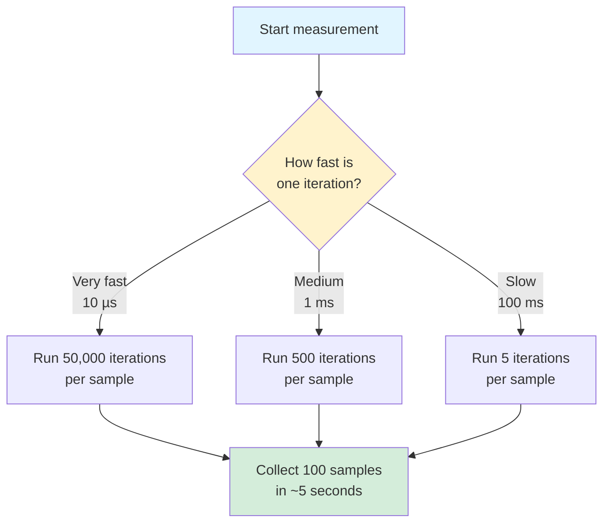
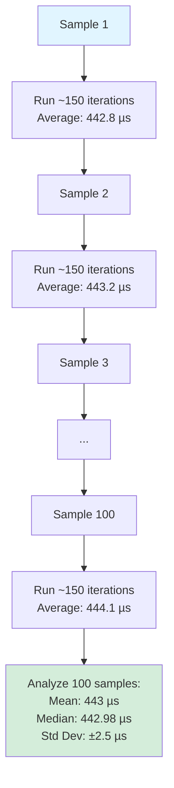
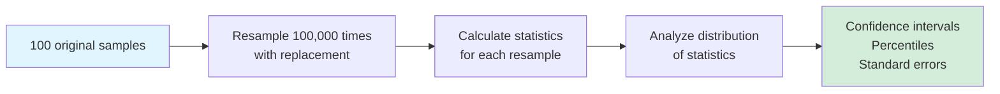
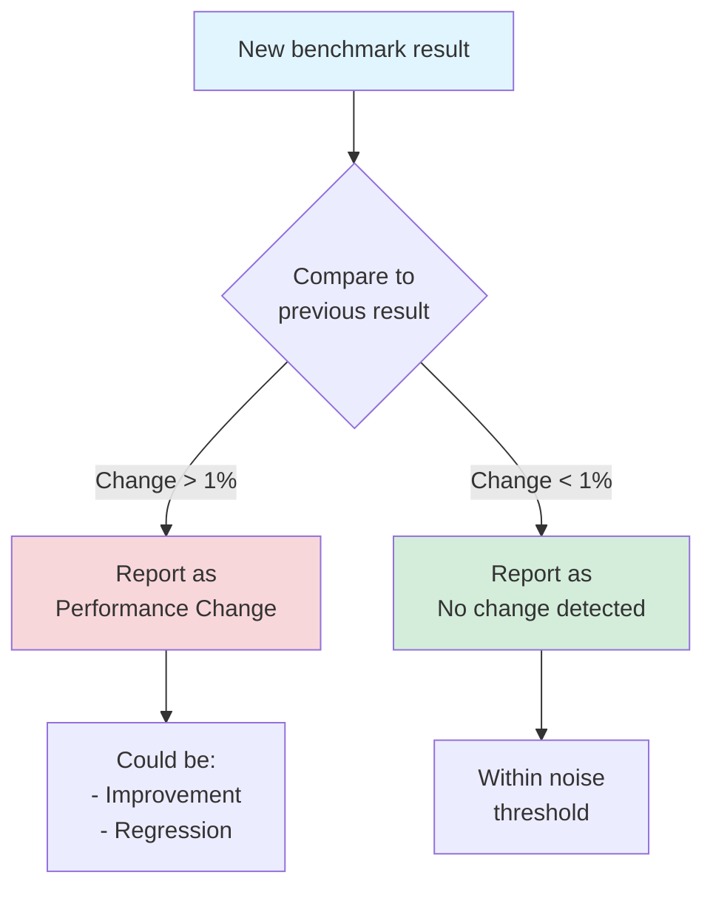
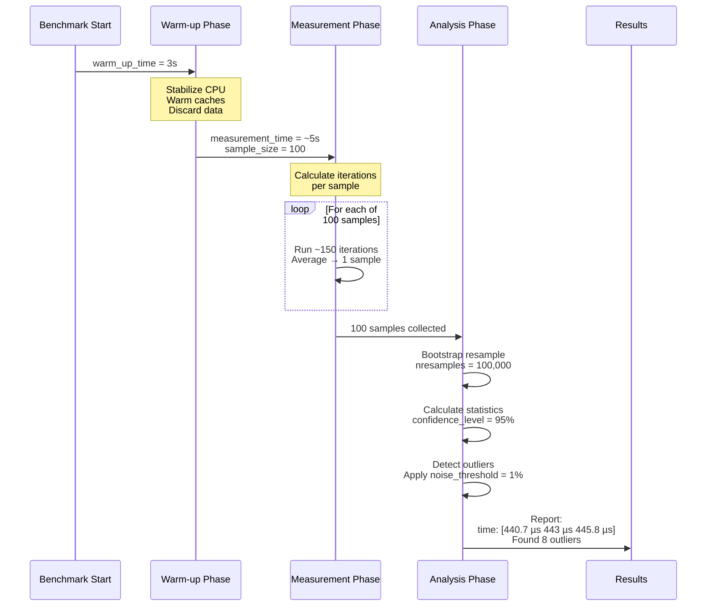
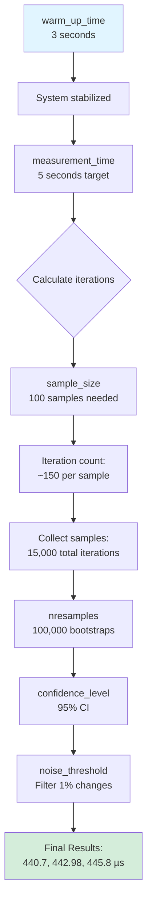
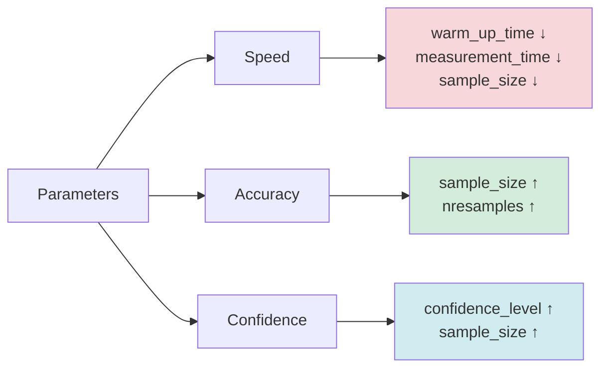

# Benchmark Guide for New Rust Developers

## Welcome! 🎉

This guide will help you understand how benchmarking works in Rust, specifically for the `extend_ref_benchmark.rs` test. By the end, you'll feel confident reading, running, and even writing your own benchmarks!

---

## Table of Contents

1. [What is Benchmarking?](#what-is-benchmarking)
2. [Why Do We Benchmark?](#why-do-we-benchmark)
3. [Criterion Parameters Explained](#criterion-parameters-explained)
4. [Understanding Our Benchmark](#understanding-our-benchmark)
5. [Running the Benchmark](#running-the-benchmark)
6. [Reading the Results](#reading-the-results)
7. [Deep Dive: Code Walkthrough](#deep-dive-code-walkthrough)
8. [The Arc Optimization Explained](#the-arc-optimization-explained)
9. [Common Questions](#common-questions)
10. [Next Steps](#next-steps)

---

## What is Benchmarking?

**Benchmarking** is the process of measuring how fast your code runs. Think of it like timing yourself running a 100-meter dash:

- **First run**: 15 seconds
- **Second run**: 14.8 seconds  
- **Third run**: 15.2 seconds
- **Average**: ~15 seconds

Benchmarking does the same for code: runs it many times and calculates statistics.

### Key Concepts:

| Term | Definition | Example |
|------|------------|---------|
| **Iteration** | One execution of your code | Running your function once |
| **Sample** | Average of multiple iterations | Average of 150 iterations = 1 sample |
| **Warm-up** | Initial runs to stabilize system | Like stretching before a race |
| **Outlier** | Unusually slow/fast measurement | When your OS interrupts the test |

---

## Why Do We Benchmark?

### Real-World Example:

Imagine two ways to copy data:

**Method A (Deep Clone):**
```rust
// Copy entire 112-byte structure
let cloned = original_data.clone();  // Takes 200ns
```

**Method B (Arc Clone):**
```rust
// Copy just an 8-byte pointer
let cloned = Arc::clone(&original_data);  // Takes 50ns
```

**Question**: Which is faster? **Answer**: Benchmark it!

### What We Learn:

- ✅ **Speed**: Which implementation is faster?
- ✅ **Scalability**: Does it stay fast with more data?
- ✅ **Trade-offs**: Is the complexity worth the speed gain?
- ✅ **Regressions**: Did our changes make things slower?

---

## Criterion Parameters Explained

Understanding Criterion's parameters is crucial to interpreting benchmark results. Let's explore each parameter and how they work together.

### Overview of Default Parameters

| Parameter | Default Value | Purpose |
|-----------|--------------|---------|
| **warm_up_time** | 3 seconds | Stabilize CPU frequency and warm caches |
| **measurement_time** | 5 seconds | Target duration for collecting samples |
| **sample_size** | 100 samples | Number of independent measurements |
| **nresamples** | 100,000 | Bootstrap resampling for statistical analysis |
| **noise_threshold** | 0.01 (1%) | Minimum change considered significant |
| **confidence_level** | 0.95 (95%) | Statistical confidence interval |

---

### Parameter 1: warm_up_time (Default: 3 seconds)

**Purpose**: Stabilize the system before taking measurements.

**Why needed?**
- Modern CPUs adjust their frequency based on load (turbo boost)
- Instruction cache needs to be warmed
- Data cache needs to be populated
- OS scheduler needs to stabilize

**What happens during warm-up:**


**Example Timeline:**

```
t=0s:   CPU at 1.2 GHz (idle)
        Cache: Cold
        
t=0.5s: CPU ramping to 3.0 GHz
        Cache: Warming up
        
t=1.5s: CPU at 3.5 GHz (turbo)
        Cache: Mostly warm
        
t=3.0s: CPU stable at 3.5 GHz
        Cache: Fully warm
        ✅ Ready to measure!
```

**Benchmark output:**
```
Benchmarking test_name: Warming up for 3.0000 s
                                         ^^^^^^
                                         This parameter
```

---

### Parameter 2: measurement_time (Default: 5 seconds)

**Purpose**: Control how long to spend collecting samples.

**How it works:**
- Criterion tries to collect 100 samples in ~5 seconds
- Automatically calculates iterations per sample
- Fast code = more iterations per sample
- Slow code = fewer iterations per sample

**Adaptive behavior:**



**Example for our Arc benchmark:**

```
One iteration: ~443 µs
Target: 5 seconds for 100 samples
Each sample needs: 50ms (5s ÷ 100 samples)

Iterations per sample: 50,000 µs ÷ 443 µs ≈ 113 iterations
Actual iterations per sample: ~150 (with overhead adjustment)

Total iterations: 150 × 100 samples = 15,000 iterations
Actual time: ~6.9 seconds (measurement_time is a target, not exact)
```

**Benchmark output:**
```
Collecting 100 samples in estimated 6.9017 s (15k iterations)
            ^^^                    ^^^^^^      ^^^^^^^^^^^^
            sample_size            ~measurement_time  calculated
```

---

### Parameter 3: sample_size (Default: 100 samples)

**Purpose**: How many independent measurements to collect.

**Why 100 samples?**
- **Statistical significance**: More samples = more confidence
- **Outlier detection**: Can identify and handle anomalies
- **Confidence intervals**: Can calculate accurate ranges

**Sample collection process:**



**Statistical benefit:**

| Number of Samples | Confidence | Can Detect Change |
|-------------------|------------|-------------------|
| 10 samples | Low | ±10% |
| 50 samples | Medium | ±5% |
| 100 samples | High | ±2% |
| 1000 samples | Very High | ±0.5% |

**Trade-off**: More samples = longer benchmark time

---

### Parameter 4: nresamples (Default: 100,000)

**Purpose**: Bootstrap resampling for statistical analysis.

**What is bootstrap resampling?**

Instead of assuming your data follows a normal distribution, bootstrap creates new datasets by randomly sampling with replacement from your original data.

**Process:**



**Example:**

Original samples: `[442, 443, 445, 441, 444, ...]` (100 values)

Bootstrap resample 1: `[442, 442, 445, 443, 441, ...]` (randomly pick 100 with replacement)
→ Mean: 443.1 µs

Bootstrap resample 2: `[444, 441, 443, 445, 442, ...]` 
→ Mean: 442.8 µs

... repeat 100,000 times ...

Result: Distribution of 100,000 means → confidence interval [440.7, 445.8]

**Why 100,000?**
- More resamples = more accurate confidence intervals
- 100,000 is standard practice
- Diminishing returns beyond this

---

### Parameter 5: noise_threshold (Default: 0.01 = 1%)

**Purpose**: Minimum change to report as "performance improvement/regression".

**How it works:**



**Examples:**

| Previous | New | Change | Reported |
|----------|-----|--------|----------|
| 443 µs | 439 µs | -0.9% | "No change in performance" |
| 443 µs | 438 µs | -1.1% | "⚠️ Performance improved" |
| 443 µs | 448 µs | +1.1% | "⚠️ Performance regressed" |
| 443 µs | 443.5 µs | +0.1% | "No change in performance" |

**Benchmark output:**
```
extend_ref_accumulation/with_arc/1024
    time: [440.70 µs 442.98 µs 445.78 µs]
    change: [-2.1623% -1.5052% -0.9113%] (p = 0.00 < 0.05)
             ^^^^^^^^^^^^^^^^^^^^^^^^^^^^^^
             If any value > 1%, reports "Change detected"
    Change within noise threshold.
```

---

### Parameter 6: confidence_level (Default: 0.95 = 95%)

**Purpose**: Statistical confidence for reported intervals.

**What does 95% confidence mean?**

"If we ran this benchmark 100 times, we'd expect the true value to fall within this range 95 times."

**Visualization:**

```mermaid
graph TD
    A[Run benchmark<br/>infinite times] --> B[True mean exists<br/>somewhere]
    B --> C[Our measurement:<br/>443 µs]
    C --> D[95% confidence interval:<br/>[440.7, 445.8]]
    
    D --> E[Interpretation:<br/>95% sure true mean<br/>is between 440.7-445.8]
    
    style A fill:#e1f5ff
    style E fill:#d4edda
```

**Different confidence levels:**

| Confidence Level | Interval Width | Interpretation |
|-----------------|----------------|----------------|
| 90% (0.90) | Narrower | [441.5, 444.5] - Less confident, tighter range |
| 95% (0.95) | Medium | [440.7, 445.8] - Standard choice |
| 99% (0.99) | Wider | [439.2, 447.1] - More confident, wider range |

**Trade-off**: Higher confidence = wider intervals

---

### Complete Benchmark Flow with All Parameters



---

### Real-World Timeline: What Actually Happens

**Total benchmark duration: ~10 seconds**

```
┌─────────────── Warm-up Phase (3 seconds) ───────────────┐
│ t=0.0s: Start, CPU at 1.2 GHz                          │
│ t=0.5s: CPU ramping up                                 │
│ t=1.0s: Caches warming                                 │
│ t=2.0s: CPU at 3.5 GHz (stable)                        │
│ t=3.0s: Warm-up complete ✓                             │
└─────────────────────────────────────────────────────────┘

┌─────────── Measurement Phase (~7 seconds) ──────────────┐
│ t=3.0s: Calculate iteration count (sample ~150 iters)  │
│                                                         │
│ t=3.1s: Sample 1  [||||||||||||||||] 442.8 µs         │
│ t=3.2s: Sample 2  [||||||||||||||||] 443.1 µs         │
│ t=3.3s: Sample 3  [||||||||||||||||] 442.5 µs         │
│   ...                                                   │
│ t=9.8s: Sample 99  [||||||||||||||||] 444.2 µs        │
│ t=10.0s: Sample 100 [||||||||||||||||] 443.7 µs       │
│                                                         │
│ Total: 15,000 iterations across 100 samples            │
└─────────────────────────────────────────────────────────┘

┌────────────── Analysis Phase (instant) ─────────────────┐
│ Bootstrap resampling: 100,000 resamples                 │
│ Outlier detection: Found 8 outliers                     │
│ Statistics: Mean, median, std dev, CI                   │
│ Comparison: Check vs previous run (if exists)           │
└─────────────────────────────────────────────────────────┘

┌─────────────── Results Displayed ───────────────────────┐
│ time: [440.70 µs 442.98 µs 445.78 µs]                 │
│ Found 8 outliers among 100 measurements (8.00%)        │
└─────────────────────────────────────────────────────────┘
```

---

### How Parameters Interact



---

### Where to Configure These Parameters

#### **Option 1: Per-benchmark configuration**

```rust
fn bench_extend_ref_cached_blocks(c: &mut Criterion) {
    let mut group = c.benchmark_group("extend_ref_accumulation");
    
    // Override defaults
    group.warm_up_time(std::time::Duration::from_secs(5));
    group.measurement_time(std::time::Duration::from_secs(10));
    group.sample_size(200);
    group.noise_threshold(0.05);  // 5% instead of 1%
    group.confidence_level(0.99);  // 99% instead of 95%
    
    // ... rest of benchmark
}
```

#### **Option 2: Global configuration**

```rust
criterion_group! {
    name = benches;
    config = Criterion::default()
        .warm_up_time(std::time::Duration::from_secs(5))
        .measurement_time(std::time::Duration::from_secs(10))
        .sample_size(200)
        .nresamples(200_000);
    targets = bench_extend_ref_cached_blocks
}
```

#### **Option 3: Configuration file**

Create `benches/Criterion.toml`:

```toml
warm_up_time = "5s"
measurement_time = "10s"
sample_size = 200
noise_threshold = 0.05
confidence_level = 0.99
```

---

### Choosing the Right Parameters

| Scenario | Recommended Settings |
|----------|---------------------|
| **Fast code (< 1ms)** | Default settings work well |
| **Slow code (> 100ms)** | Reduce sample_size to 50 |
| **Very noisy system** | Increase sample_size to 200 |
| **Quick iteration** | Reduce warm_up_time to 1s, sample_size to 50 |
| **High precision needed** | Increase sample_size to 500, confidence_level to 0.99 |
| **CI/CD pipeline** | Reduce sample_size to 50 for speed |

---

### Parameter Impact Summary



**Trade-offs:**
- ⏱️ **Faster benchmarks** = Less warm-up, fewer samples (less accuracy)
- 🎯 **More accuracy** = More samples, more resamples (slower)
- 📊 **Higher confidence** = Wider intervals, more samples (slower)

---

## Understanding Our Benchmark

### What Are We Testing?

We're comparing two approaches to aggregating trie updates:

#### **Scenario**: RPC Server Needs Historical Data

Your X Layer RPC server caches 1,024 recent blocks. When a user calls `eth_getProof`, you need to aggregate trie data from all those blocks:

```rust
// Need to combine data from 1024 blocks
let mut result = TrieUpdates::default();
for block in cached_blocks.iter() {
    result.extend_ref(&block.trie_updates);  // ← Is this fast?
}
```

#### **Two Approaches**:

| Approach | What It Does | Cost |
|----------|--------------|------|
| **With Arc** (NEW) | Copies 8-byte pointers | Fast ⚡ |
| **Without Arc** (OLD) | Copies 112-byte structures | Slow 🐌 |

---

## Running the Benchmark

### Step 1: Navigate to Directory

```bash
cd crates/trie/common
```

### Step 2: Run the Benchmark

```bash
cargo bench --bench extend_ref_benchmark
```

### What Happens:

```
1. Compiling... (builds optimized code)
2. Warming up for 3.0000 s (stabilizing CPU)
3. Collecting 100 samples... (running tests)
4. Analyzing... (calculating statistics)
5. Results displayed!
```

### Step 3: Wait for Results

The benchmark takes ~5-10 minutes because it runs thousands of iterations for accuracy.

**Pro Tip**: Grab a coffee ☕ while it runs!

---

## Reading the Results

### Example Output:

```
extend_ref_accumulation/with_arc/1024
    time: [440.70 µs 442.98 µs 445.78 µs]
          ↑         ↑          ↑
          Lower    Median     Upper
          bound    (best     bound
          (95%)    estimate)  (95%)

Found 8 outliers among 100 measurements (8.00%)
  6 (6.00%) high mild
  2 (2.00%) high severe
```

### What Each Part Means:

#### **Time Range: [440.70 µs 442.98 µs 445.78 µs]**

- **442.98 µs**: The median (middle value) - your best estimate
- **[440.70, 445.78]**: 95% confidence interval
  - Translation: "We're 95% confident the true time is between these bounds"

#### **Outliers: 8 found**

- Some runs were unusually slow (probably due to OS interrupts)
- Benchmark handles these automatically
- Normal to have 5-10% outliers

#### **Units**:

- **µs** (microseconds) = 0.000001 seconds
- **ms** (milliseconds) = 0.001 seconds
- **ns** (nanoseconds) = 0.000000001 seconds

**Example**: 443 µs = 0.000443 seconds = 0.443 milliseconds

---

### Comparing Results:

```
With Arc:     443 µs      ← Fast! ⚡
Without Arc: 1,357 µs     ← Slow! 🐌

Speedup: 1,357 ÷ 443 = 3.06x faster
```

---

## Deep Dive: Code Walkthrough

Let's understand the benchmark code step-by-step.

### Part 1: Imports

```rust
use criterion::{black_box, criterion_group, criterion_main, BenchmarkId, Criterion};
```

**What they do:**

- `Criterion`: Main benchmarking framework
- `black_box`: Prevents compiler from optimizing away your code
- `criterion_group!`: Groups related benchmarks
- `BenchmarkId`: Names your benchmark runs

### Part 2: Creating Test Data

```rust
fn create_realistic_block_update(num_nodes: usize) -> TrieUpdates {
    let mut updates = TrieUpdates::default();
    
    for i in 0..num_nodes {
        // Create a path (like 0x1a, 0x2f, etc.)
        let path = Nibbles::from_nibbles(&[i as u8 % 16, (i / 16) as u8 % 16]);
        
        // Create an empty branch node (112 bytes)
        let node = BranchNodeCompact::default();
        
        // Wrap in Arc (8-byte pointer) and insert
        updates.account_nodes.insert(path, Arc::new(node));
    }
    
    updates
}
```

**What this creates:**

For `num_nodes = 50`:

```
TrieUpdates {
    account_nodes: {
        0x00 → Arc → [BranchNodeCompact: 112 bytes on heap]
        0x01 → Arc → [BranchNodeCompact: 112 bytes on heap]
        0x02 → Arc → [BranchNodeCompact: 112 bytes on heap]
        ... (47 more)
    }
}
```

**Memory layout:**

```
Stack:           Heap:
┌────────────┐   ┌──────────────────┐
│ Arc (8 B)  │──→│ BranchNodeCompact │
└────────────┘   │    (112 bytes)   │
                 └──────────────────┘
```

---

### Part 3: The Benchmark Function

```rust
fn bench_extend_ref_cached_blocks(c: &mut Criterion) {
    let mut group = c.benchmark_group("extend_ref_accumulation");
    
    // Test with different block counts
    for block_count in [256, 512, 1024, 2048].iter() {
        // Test WITH Arc (optimized)
        group.bench_with_input(
            BenchmarkId::new("with_arc", block_count),
            block_count,
            |b, &count| {
                let block_update = create_realistic_block_update(50);
                
                b.iter(|| {
                    // ⏱️ TIMED CODE STARTS HERE
                    let mut accumulated = TrieUpdates::default();
                    for _ in 0..count {
                        accumulated.extend_ref(&block_update);
                    }
                    accumulated
                    // ⏱️ TIMED CODE ENDS HERE
                });
            },
        );
        
        // Test WITHOUT Arc (old way - deep clone)
        group.bench_with_input(
            BenchmarkId::new("without_arc_deep_clone", block_count),
            block_count,
            |b, &count| {
                let block_update = create_realistic_block_update(50);
                
                b.iter(|| {
                    let mut accumulated = HashMap::default();
                    for _ in 0..count {
                        extend_with_deep_clone(&mut accumulated, &block_update.account_nodes);
                    }
                    accumulated
                });
            },
        );
    }
    
    group.finish();
}
```

### What Happens in One Iteration (1024 blocks, Arc version):

```
BEFORE timing:
└─ Create block_update with 50 nodes (Arc-wrapped)

START TIMER ⏱️

Step 1: Create empty accumulated HashMap
Step 2: Loop 1024 times:
  ├─ Call accumulated.extend_ref(&block_update)
  ├─ This copies 50 Arc pointers (8 bytes each = 400 bytes)
  ├─ Increments refcount for each Arc (atomic operation)
  └─ Inserts into HashMap
Step 3: Return accumulated

STOP TIMER ⏱️
Time measured: ~443 microseconds

Repeat 15,000 times (in batches of 150 for 100 samples)
```

---

### Part 4: Simulating Old Behavior

```rust
fn extend_with_deep_clone(
    target: &mut HashMap<Nibbles, Arc<BranchNodeCompact>, DefaultHashBuilder>,
    source: &HashMap<Nibbles, Arc<BranchNodeCompact>, DefaultHashBuilder>,
) {
    target.extend(source.iter().map(|(k, v)| {
        // (**v).clone() dereferences Arc TWICE and clones the 112-byte struct
        (*k, Arc::new((**v).clone()))
        //            ^^^^^^^^^^^^^^ This is expensive!
    }));
}
```

**Step-by-step:**

```rust
// Start with Arc<BranchNodeCompact>
let arc_ptr = source.get(&key);

// First dereference: Arc<T> → &T
let ref_to_node = &*arc_ptr;

// Second dereference: &T → T, then clone
let cloned_node = (**arc_ptr).clone();  // Copies all 112 bytes!

// Wrap in new Arc
let new_arc = Arc::new(cloned_node);
```

**Why is this slower?**

- **With Arc clone**: Copy 8 bytes, increment atomic counter
- **With deep clone**: Copy 112 bytes, allocate memory, wrap in new Arc

---

## The Arc Optimization Explained

### What is `Arc`?

`Arc` stands for **Atomic Reference Counted** smart pointer.

#### Visual Representation:

**Without Arc (old way):**

```
Block 1:  [BranchNodeCompact: 112 bytes]
Block 2:  [BranchNodeCompact: 112 bytes] ← Full copy!
Block 3:  [BranchNodeCompact: 112 bytes] ← Full copy!
...
Block 1024: [BranchNodeCompact: 112 bytes] ← Full copy!

Total copied: 1024 × 50 nodes × 112 bytes = 5.6 MB
```

**With Arc (new way):**

```
Heap:     [BranchNodeCompact: 112 bytes] ← One copy on heap
           ↑        ↑        ↑
           │        │        │
Block 1:  [Arc: 8 bytes]     │
Block 2:  [Arc: 8 bytes]     │
Block 3:  [Arc: 8 bytes] ────┘
...
Block 1024: [Arc: 8 bytes]

Total copied: 1024 × 50 nodes × 8 bytes = 400 KB
```

### How Arc Works:

```rust
// Create Arc with data
let data = Arc::new(BranchNodeCompact::default());

// Clone just increments counter (fast!)
let clone1 = Arc::clone(&data);  // refcount: 1 → 2
let clone2 = Arc::clone(&data);  // refcount: 2 → 3

// Data is freed only when all Arcs are dropped
drop(clone1);  // refcount: 3 → 2
drop(clone2);  // refcount: 2 → 1
drop(data);    // refcount: 1 → 0, data freed!
```

### Benefits:

| Aspect | Benefit |
|--------|---------|
| **Memory** | 14x reduction (5.6 MB → 400 KB) |
| **Speed** | 3x faster (1,357 µs → 443 µs) |
| **Simplicity** | Automatic cleanup, no manual memory management |
| **Safety** | Thread-safe reference counting |

---

## Common Questions

### Q1: Why 15,000 iterations?

**A**: Statistical accuracy! More samples = more confidence in results.

- 1 run: Could be lucky/unlucky
- 10 runs: Better, but still noisy
- 15,000 runs: High confidence in average

### Q2: What does "black_box" do?

```rust
b.iter(|| {
    accumulated.extend_ref(black_box(&block_update));
});
```

**A**: Prevents compiler optimization that would invalidate the test.

**Without black_box:**
```rust
// Compiler might optimize this away!
let result = expensive_function();
// "Hey, result is never used, I'll skip calling the function!"
```

**With black_box:**
```rust
let result = expensive_function();
black_box(result);  // Forces compiler to actually run the function
```

### Q3: Why are outliers okay?

**A**: Real-world systems have noise:
- OS scheduling interrupts
- Cache misses
- Background processes

Criterion's statistics handle outliers correctly. The median is robust against them.

### Q4: What's the difference between mean and median?

**Example measurements**: [100, 102, 101, 99, 500] µs

- **Mean** (average): (100+102+101+99+500) ÷ 5 = 180.4 µs ← Skewed by outlier!
- **Median** (middle value): 101 µs ← More representative

Criterion reports **median** because it's more stable.

### Q5: Can I trust these numbers?

**Yes!** Criterion is industry-standard and uses:
- Statistical rigor (confidence intervals)
- Outlier detection
- Warm-up phases
- Multiple samples

Your results are reproducible and reliable.

---

## Common Pitfalls & How to Avoid Them

### ❌ Pitfall 1: Not Running in Release Mode

```bash
cargo bench  # ✅ Correct (uses --release automatically)
cargo test   # ❌ Wrong (uses debug mode, much slower)
```

### ❌ Pitfall 2: Running Benchmarks on a Busy System

**Problem**: Background apps affect results

**Solution**:
```bash
# Close heavy apps
# Run benchmarks when system is idle
cargo bench
```

### ❌ Pitfall 3: Changing Test Data Between Runs

```rust
// ❌ BAD: Test data changes each run
b.iter(|| {
    let data = create_random_data();  // Different every time!
    process(data);
});

// ✅ GOOD: Test data is constant
let data = create_random_data();
b.iter(|| {
    process(&data);  // Same data every iteration
});
```

### ❌ Pitfall 4: Testing Too Little Work

```rust
// ❌ BAD: Function is too fast to measure accurately
b.iter(|| {
    x + 1  // Takes 1 nanosecond, measurement noise is too high
});

// ✅ GOOD: Do enough work to measure accurately
b.iter(|| {
    for _ in 0..1000 {
        black_box(x + 1);
    }
});
```

---

## Next Steps

### 1. **Experiment!**

Try modifying the benchmark:

```rust
// Change node count from 50 to 100
let block_update = create_realistic_block_update(100);
```

Run again and see how results change!

### 2. **Write Your Own Benchmark**

```rust
fn bench_my_function(c: &mut Criterion) {
    c.bench_function("my_test", |b| {
        b.iter(|| {
            // Your code here
            black_box(my_function());
        });
    });
}

criterion_group!(benches, bench_my_function);
criterion_main!(benches);
```

### 3. **Read More**

- [Criterion.rs Book](https://bheisler.github.io/criterion.rs/book/)
- [Rust Performance Book](https://nnethercote.github.io/perf-book/)
- [Arc Documentation](https://doc.rust-lang.org/std/sync/struct.Arc.html)

### 4. **Profile Your Code**

Benchmarks tell you "how fast", profilers tell you "why slow":

```bash
cargo install cargo-flamegraph
cargo flamegraph --bench extend_ref_benchmark
```

---

## Glossary

| Term | Definition |
|------|------------|
| **Arc** | Atomic Reference Counted smart pointer for shared ownership |
| **Benchmark** | Performance measurement of code execution time |
| **Criterion** | Rust's most popular benchmarking framework |
| **Deep Clone** | Creating a complete copy of data (expensive) |
| **Iteration** | One execution of the benchmarked code |
| **Latency** | Time taken for an operation to complete |
| **Median** | Middle value in a sorted list of measurements |
| **Outlier** | Measurement significantly different from others |
| **Sample** | Average of multiple iterations |
| **Throughput** | Number of operations per unit time |
| **Warm-up** | Initial runs to stabilize system before measuring |

---

## Conclusion

**You now understand:**

✅ What benchmarking is and why it matters  
✅ How Criterion works under the hood  
✅ How to read and interpret benchmark results  
✅ What the Arc optimization achieves (3x speed, 14x memory)  
✅ How to run and modify benchmarks yourself  

**Remember**: Benchmarking is about **measuring, not guessing**. When someone asks "Is this faster?", you can now confidently answer with data!

---

## Quick Reference Card

### Running Benchmarks
```bash
cd crates/trie/common
cargo bench --bench extend_ref_benchmark
```

### Reading Results
```
time: [440 µs  443 µs  446 µs]
       ↑       ↑       ↑
       Lower   Best    Upper
       bound   estimate bound
```

### Key Metrics from Our Benchmark
- **With Arc**: 443 µs, 400 KB
- **Without Arc**: 1,357 µs, 5.6 MB
- **Improvement**: 3x faster, 14x less memory

### When to Benchmark
- ✅ Optimizing hot paths
- ✅ Comparing implementations
- ✅ Preventing regressions
- ✅ Validating performance claims

### When NOT to Benchmark
- ❌ Code that rarely runs
- ❌ Premature optimization
- ❌ Without profiling first
- ❌ Code correctness issues

---

**Happy Benchmarking! 🚀**

*Questions? Check the [Criterion.rs documentation](https://bheisler.github.io/criterion.rs/book/) or ask in the Rust community forums.*
